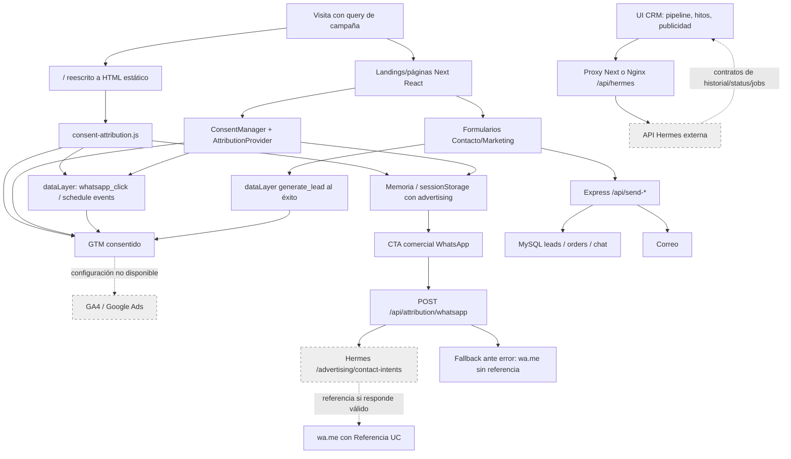
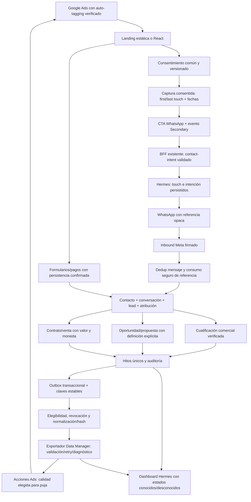

# Auditoría técnica: Google Ads, GA4, atribución, WhatsApp y CRM

Fecha: **2026-09-28**, America/Guayaquil. Repositorio: `undercodeec_nextjs`, rama `main`, revisión `ca121ba` más el estado local existente. Alcance: auditoría, pruebas locales y este informe; no implementación.

## 1. Executive Summary

**Hay infraestructura de atribución y una interfaz de conversiones bastante avanzada. No hay evidencia suficiente para declarar operativo el circuito Google Ads → WhatsApp → lead cualificado → Google.** El tramo web está implementado; la persistencia, correlación con el webhook y exportación dependen de **Hermes, un servicio cuyo backend no está en este repositorio**. No se debe rehacer desde cero lo que ya existe ni confundir una pantalla de configuración con un envío comprobado.

Las piezas demostradas son:

- Captura de `gclid`, `gbraid`, `wbraid` y cinco UTMs; persistencia en `sessionStorage` con consentimiento publicitario. Evidencia: `src/lib/attribution/params.mjs:1`, `src/components/Attribution/AttributionProvider.jsx:55`, `public/landing-primary/js/consent-attribution.js:80`.
- API propia que valida la intención, elimina identificadores si `adStorage` está denegado y llama a `/advertising/contact-intents` en Hermes con una clave de servidor. Evidencia: `src/lib/attribution/schema.mjs:102`, `src/app/api/attribution/whatsapp/route.ts:54`, `src/app/api/attribution/whatsapp/route.ts:103`.
- Referencia opaca `UC-…` añadida al texto de WhatsApp; si la API falla, el contacto continúa sin referencia. Evidencia: `src/lib/attribution/whatsapp-client.mjs:16`, `src/lib/attribution/whatsapp-client.mjs:27`.
- GTM condicionado al consentimiento, estados de Consent Mode v2 y eventos `whatsapp_click`, `generate_lead`, `schedule_open`, `schedule_complete`. Evidencia: `src/components/Consent/ConsentManager.jsx:141`, `src/app/layout.tsx:200`, `src/components/Contact/Form.jsx:128`, `public/landing-primary/js/demo-local.js:65`.
- CRM con etapas `QUALIFIED` y `WON`, mapeos de conversión, hitos comerciales con importe/moneda y visualización de `syncJob.status`/`validateOnly`. Evidencia: `src/app/admin/crm/_components/constants.js:1`, `src/app/admin/crm/publicidad/page.jsx:116`, `src/app/admin/crm/leads/[id]/page.jsx:379`, `src/app/admin/crm/leads/[id]/page.jsx:507`.

Los bloqueos principales son la dependencia de Hermes sin verificar, su configuración local ausente, la pérdida de atribución entre documentos antes de consentir y un contrato reCAPTCHA incorrecto en Contacto. También faltan first touch real, `utm_id`, pruebas del receptor/exportador y garantías demostrables de idempotencia publicitaria. Evidencia detallada en §§6, 10, 17 y 20.

### Respuestas directas

| Pregunta | Respuesta demostrable | Evidencia |
|---|---|---|
| ¿Guardamos GCLID? | En la sesión del navegador si se permite publicidad; se prepara y transmite al contrato Hermes. Persistencia definitiva en CRM no verificable. | `AttributionProvider.jsx:66`; `hermes-contract.mjs:21` |
| ¿GBRAID/WBRAID? | Mismo soporte web y contrato que GCLID. | `params.mjs:44`; `hermes-contract.mjs:22` |
| ¿UTMs? | Source, medium, campaign, content y term; `utm_id` no. | `params.mjs:1`, `params.mjs:49` |
| ¿First/last touch? | Un único touch reemplazable por la última URL etiquetada; no historial ni first touch inmutable. | `AttributionProvider.jsx:60`; `consent-attribution.js:101` |
| ¿Clic Ads → WhatsApp? | Existe un puente por referencia prellenada. El usuario debe enviar el mensaje con la referencia; receptor no inspeccionable aquí. | `whatsapp-client.mjs:23`; `route.ts:117` |
| ¿WhatsApp → Lead CRM? | La UI espera contacto/conversación/lead y atribución. La unión en backend no se puede demostrar. **Gap crítico de verificación.** | `leads/[id]/page.jsx:373`; `src/lib/hermes/api.js:366` |
| ¿Cuándo se cualifica? | La UI cambia `stage` a `QUALIFIED` y afirma que Hermes genera `LEAD_QUALIFIED`; regla y transacción backend no verificables. | `leads/[id]/page.jsx:107`, `leads/[id]/page.jsx:450` |
| ¿Devolver Qualified Lead a Google? | Hay mapeo e historial esperados; no un exportador local. Resultado de Hermes/Google no verificable. | `publicidad/page.jsx:142`; `api.js:323` |
| ¿Devolver oportunidad? | Hay `PROPOSAL_SENT` y `MEETING_CONFIRMED`; no evento explícito `OPPORTUNITY_CREATED` en el contrato visible. | `publicidad/page.jsx:25`; `leads/[id]/page.jsx:456` |
| ¿Venta y valor? | Se puede solicitar `CONTRACT_WON` con `value`, `currency`, `revenueReceived` y referencia comercial. Persistencia y envío no verificables. | `leads/[id]/page.jsx:388`, `leads/[id]/page.jsx:471` |
| ¿Enhanced Conversions web/leads? | Sin implementación explícita de user data publicitaria local; GTM y Hermes podrían contenerla. Estado externo no verificable. | Búsquedas S1/S2; `publicidad/page.jsx:454` |
| ¿Legacy que migrar? | No se encontró `UploadClickConversions` ni equivalente local. No declarar legacy funcional sin revisar Hermes. | S2; `README.md:85` |
| ¿Conversiones duplicadas? | No se observó envío real ni duplicación efectiva. Hay riesgos de configuración y no hay deduplicación publicitaria persistente demostrada aquí. | §§8 y 17 |
| ¿Ads podría optimizar clics WhatsApp? | Sí, si ese evento se usa como Primary o dentro de un objetivo personalizado de puja. La UI permite mapearlo; configuración efectiva externa desconocida. | `publicidad/page.jsx:25`, `publicidad/page.jsx:494`; fuente Google en §19 |
| ¿Qué falta antes de invertir? | Verificar Hermes/GTM/Ads, cerrar los P0 y P1 y demostrar la ruta de cualificación sin envíos productivos de prueba. | §§20–22 |

### Método y límites

Se inventariaron `src`, `backend`, `public`, `tests`, `scripts`, configuración y documentación, además de copias en worktrees. Se inspeccionaron las coincidencias por significado y sus llamadas. Los archivos descargados de terceros se distinguieron del código que carga la aplicación. Dependencias, bundles generados, cachés, bases internas de herramientas y snapshots no se trataron como fuentes autoritativas del despliegue.

Se usaron búsquedas globales `rg` con las familias pedidas y equivalentes. Para referenciar hallazgos negativos:

- **S1 — Captura/analytics/consentimiento:** `gclid|gbraid|wbraid|gad_source|utm_|gtag|GTM-|AW-|GA4|dataLayer|ReactGA|consent|first.?touch|last.?touch|attribution|referrer|msclkid|fbclid|matchtype|adgroup`.
- **S2 — Exportación:** `google.?ads|conversion_action|UploadClickConversions|uploadClick|IngestEvents|ingestEvents|datamanager|data-manager|googleads.googleapis|measurement.?protocol|enhanced|userIdentifiers|hashedEmail|hashedPhone` y dependencias/API/rutas.
- **S3 — WhatsApp/CRM/deduplicación:** `wa.me|api.whatsapp|webhook|wa_id|waId|qualified|score|opportunity|WON|revenue|order_id|event_id|processed_at|syncJob|idempot|dedup|sha256|X-Hub-Signature`, más modelos SQL y flujos de actualización.

Las conclusiones negativas significan **no encontrado en este checkout**, no ausencia global en Hermes, GTM o las cuentas. No se consultaron cuentas privadas, bases de datos productivas ni APIs de Google/Meta. Ninguna credencial o teléfono real se reproduce en el informe.

## 2. Arquitectura encontrada

| Capa | Implementación y función | Evidencia |
|---|---|---|
| Frontend | Next.js 16.1.2, React 19.2.3, App Router, TypeScript/JSX. | `package.json:1`; `src/app/layout.tsx:189` |
| Portada | `/` se reescribe a HTML estático `/landing-primary/index.html`; no utiliza los providers React de la portada antigua. | `next.config.ts:20`; `public/landing-primary/index.html:455` |
| Otras páginas | Providers React de consentimiento/atribución y botón Hermes global. | `src/app/layout.tsx:235` |
| Backend local | Express 5, Node, CommonJS; pagos, formularios, chat, administración. Puerto por defecto 3001. | `backend/package.json:1`; `backend/server.js:1`, `backend/server.js:4722` |
| Base activa local | MySQL/MariaDB con `mysql2/promise`; consultas adaptadas al formato de `pg`. Se inicializan tablas al importar el módulo. | `backend/server.js:23`; `backend/db.js:5`, `backend/db.js:17`, `backend/db.js:227` |
| ORM | No hay ORM activo local: SQL directo. ORM y esquema de Hermes no están disponibles. | `backend/db.js:26`; inventario de dependencias/esquemas S3 |
| PostgreSQL/Supabase | Adaptadores y dependencias existentes, pero no importados por la API activa. | `backend/db_pg.js:1`; `backend/supabaseClient.js:1`; `src/lib/supabaseClient.js:1`; S3 |
| Autenticación | Chat con tokens firmados/cookies y contraseñas bcrypt; acceso CRM por OTP local y proof intercambiado por sesión Hermes; JWT administrativo. | `backend/server.js:193`, `backend/server.js:917`; `src/lib/hermes/api.js:299` |
| CRM | Frontend Hermes en `/admin/crm`, proxy Next y alternativa Nginx hacia backend externo descrito como NestJS. | `src/app/api/hermes/[...path]/route.ts:21`; `nginx.conf.example:107`; `README.md:85` |
| WhatsApp | Enlaces `wa.me`, referencia prellenada y contrato contact-intent. Cloud API/webhook/asistente WhatsApp no implementados en el backend local. | `whatsapp-client.mjs:5`; `route.ts:60`; S3 |
| IA local | Asistente Karen: plantillas comerciales, Gemini y TTS. Su componente no tiene importador activo encontrado. Es distinto de Hermes por WhatsApp. | `backend/chatCommercialPlaybook.js:190`; `backend/server.js:2338`; S3 de importadores de `AIAssistant` |
| Trabajos | Limpieza de pagos, mapas de cuotas/OTP y cola Puppeteer para scraping. No worker publicitario local encontrado. La UI espera jobs de Hermes. | `backend/server.js:69`, `backend/server.js:106`, `backend/server.js:561`, `backend/server.js:1083`; `leads/[id]/page.jsx:512` |

**Mapa simplificado:** URL etiquetada → captura web condicionada → sesión web → CTA → BFF de atribución → Hermes contact-intent → referencia en texto `wa.me`. Desde el mensaje recibido hasta la exportación, el repositorio muestra contratos y UI, no el backend ejecutor. En paralelo, formularios/pagos → Express → MySQL/correo; no se encontró unión de esas entidades con la atribución Hermes.

### Código existente sin uso demostrado o con nombres engañosos

| Pieza | Qué existe y límite de uso | Evidencia |
|---|---|---|
| `AIAssistant` | Componente y endpoints locales, sin importador encontrado en la aplicación actual. No demuestra el asistente WhatsApp. | `src/components/AIAssistant/index.jsx:14`; `src/app/layout.tsx:242`; S3 |
| Portada React antigua | Sigue definida e importa `InnerPages`, pero el rewrite de `/` entrega HTML estático. | `src/app/page.tsx:8`, `src/app/page.tsx:55`; `next.config.ts:24` |
| `react-ga4` | Dependencia y llamadas; no hay `ReactGA.initialize` encontrado. GTM es la vía de GA4 documentada. | `package.json`; S1; `README.md:74` |
| Adaptador `db_pg` | No importado por `server.js`; el log de guardado de pedidos dice PostgreSQL, aunque la conexión activa es MySQL. | `backend/server.js:23`, `backend/server.js:3152`; `backend/db_pg.js:1` |
| `saveOrderToSupabase` | Alias que llama al guardado local, no a Supabase. | `backend/server.js:3167` |
| Tags de diseños descargados | IDs GA `G-…` en documentos originales de terceros; no demuestran una propiedad Undercodeec. No encontrados en los HTML públicos saneados inspeccionados. | `desing/saveweb2zip-com-www-itsoffbrand-com/index.html:181`; `saveweb2zip-com-dala-craftedbygc-com/index.html:1`; `scripts/offbrand-demo/prepare.mjs`; S1 |

No borrar estas piezas como parte de la auditoría. Decidir su mantenimiento sólo después de confirmar consumidores y despliegue.

## 3. Implementaciones Google existentes

| Integración | Hallazgo | Evidencia |
|---|---|---|
| Google Tag Manager | Un contenedor público, mostrado parcialmente como `GTM-WX7H…`, cargado en React y portada estática después del consentimiento relevante. | `ConsentManager.jsx:141`; `consent-attribution.js:53` |
| Google tag / GA4 / Ads tag | No `gtag.js` directo ni ID `AW-…`/`G-…` propio activo encontrado. Pueden existir en GTM, cuyo contenido no está versionado aquí. `window.gtag` en el repo encola consentimiento, no prueba un destino. | `src/app/layout.tsx:200`; S1; `README.md:74` |
| Ads/Data Manager | Interfaz, mapeos y contratos Hermes; sin cliente de ingestión local. | `publicidad/page.jsx:454`; `src/lib/hermes/api.js:323`; S2 |
| reCAPTCHA Enterprise | REST server-side y site key pública en formularios; es protección del formulario, no Ads. | `backend/server.js:775`; `src/components/RecaptchaEnterpriseScript.jsx:9` |
| Gemini/TTS | IA y síntesis de voz, sin relación directa con la exportación Ads. | `backend/server.js:667`, `backend/server.js:1781` |
| Apps Script/Drive | Flujos de pedidos con Apps Script y código antiguo de wizard. No es Google Ads API ni Data Manager. | `backend/server.js:1523`, `backend/server.js:1635`; `src/components/Preview/InnerPages.jsx:767` |

Las otras APIs de Google no constituyen evidencia de medición Ads. Los detalles actuales de Google están contrastados en §12.

## 4. Tracking frontend

Los eventos siguientes son **llamadas verificables**, no prueba de recepción por GA4 o Ads. En las filas `dataLayer`, GA4/Ads dependen de los triggers/tags publicados de GTM; en las filas Hermes, dependen del backend externo.

| Evento/llamada | Archivo y línea | Trigger y payload relevante | Destino y llegada verificable | Capa |
|---|---|---|---|---|
| `whatsapp_click` | `src/components/HermesWhatsAppButton/index.jsx:123` | Clic normal del botón; `contact_method`, `source=hermes_whatsapp_button`, `page_path`; analytics **o** advertising concedidos. | `dataLayer`; GA4/Ads no verificables. | Cliente |
| `whatsapp_click` | `src/components/Attribution/CommercialWhatsAppAttribution.jsx:32` | Clic en enlace comercial `wa.me`; source `commercial_whatsapp_link`, método y path. | `dataLayer`; GA4/Ads no verificables. | Cliente |
| `whatsapp_click` | `public/landing-primary/js/consent-attribution.js:163` | Enlace comercial de la portada, incluidos botón flotante y CTA; mismo payload. | `dataLayer`; GA4/Ads no verificables. | Cliente |
| `generate_lead` | `src/components/Contact/Form.jsx:128` | Respuesta HTTP correcta y `status=success`; `form_id`, `lead_type`, `service_interest` de selector, path. | `dataLayer`; GA4/Ads no verificables. Su trigger está bloqueado por el contrato reCAPTCHA actual. | Cliente |
| `generate_lead` | `src/components/Marketing/MarketingPrimaryContent.jsx:175` | Respuesta de éxito; `form_id`, `lead_type`, path. | `dataLayer`; GA4/Ads no verificables. No prueba por sí solo persistencia DB. | Cliente |
| `schedule_open` | `public/landing-primary/js/demo-local.js:116` | Abrir iframe de Calendly; `booking_type`, path. | `dataLayer`; GA4/Ads no verificables. | Cliente |
| `schedule_complete` | `public/landing-primary/js/demo-local.js:65` | `postMessage` de origen Calendly y evento `calendly.event_scheduled`; payload sin datos del invitado. | `dataLayer`; GA4/Ads no verificables. No equivale a reunión persistida en Hermes. | Cliente |
| `WhatsAppHermesClick` | `src/components/HermesWhatsAppButton/config.mjs:27` | Botón Hermes React, sólo publicidad; source/path. | Meta `trackCustom`; no Google. | Cliente |
| `Contact`, `CompleteRegistration` | `src/components/Contact/Form.jsx:90`, `src/components/Contact/Form.jsx:134` | Intento antes del backend, y respuesta exitosa respectivamente. | Meta Pixel. No son leads cualificados ni prueba GA4/Ads. | Cliente |
| `PageView` | `ConsentManager.jsx:151`; `consent-attribution.js:58` | Carga inicial consentida de Meta Pixel. | Meta. Navegación SPA posterior no tiene `PageView` explícito local. | Cliente |
| Cambio `stage=QUALIFIED` | `src/app/admin/crm/leads/[id]/page.jsx:107` | Operador confirma etapa; `{stage}` por `PUT /leads/:id`. | Hermes; no push directo a GA4/Ads. | Cliente → servidor externo |
| `MEETING_CONFIRMED`, `PROPOSAL_SENT`, `CONTRACT_WON`, `CONTRACT_LOST` | `src/app/admin/crm/leads/[id]/page.jsx:379` | Formulario comercial; tipo, fecha opcional, servicio, importe/moneda/ingresos/referencia según hito. | Hermes `/advertising/leads/:id/events`; envío Google no verificable. | Cliente → servidor externo |

### Llamadas `ReactGA.event` restantes

No se encontró inicialización de la librería en el código activo. Por tanto estas llamadas **no pueden declararse eventos GA4 funcionales**; tampoco se asume que cargar GA4 por GTM inicialice la instancia `ReactGA`. No hay envío Ads directo en ellas.

| Archivo y línea | Acción, trigger y payload | Uso actual |
|---|---|---|
| `src/components/Contact/Form.jsx:83` | `Envío del formulario`; intento de submit; categoría, label, value=1. | Página Contacto activa. Se dispara antes de reCAPTCHA/éxito. |
| `src/components/Marketing/MarketingPrimaryContent.jsx:383` | `Click en botón`; apertura del formulario; categoría/label. | Marketing activo. |
| `src/components/Navbars/UnderCodeec/index.jsx:48` | `channel.event`; clic de canal; categoría y nombre del canal. | Página `/undercodeec`, excluida de carga inicial de tags. |
| `src/components/App/Testimonials.jsx:10` | `Interacción con iframe`; nombreDemo como label. | Componente existente; su vigencia depende de importadores de la página. |
| `src/components/Startup/ChooseUs.jsx:23` | `click_${platform}`; enlace de red; categoría y label de plataforma. | Componente existente, con llamada Meta adicional. |
| `src/components/Startup/Numbers.jsx:32` | `Click en botón`; apertura modal; categoría/label. | Componente existente. |
| `src/components/Preview/InnerPages.jsx:713` | `click_tipo_proyecto`; selección; projectId como label. | Portada React antigua desplazada por rewrite. |
| `src/components/Preview/InnerPages.jsx:776`, `:822` | `order_submitted`; submit de pedido; plan y precio. | Mismo código antiguo. Submit no es pago confirmado. |
| `src/components/Preview/InnerPages.jsx:937` | `payment_initiated`; inicio PayPhone; plan e importe. | Mismo código antiguo. |
| `src/components/Preview/InnerPages.jsx:1140` | `payment_completed`; handler de resultado; plan e importe pagado. | Mismo código antiguo; no se encontró `purchase` ecommerce activo. |
| `src/components/Preview/InnerPages.jsx:1314` | `transfer_order_submitted`; transferencia; plan e importe. | Transferencia pendiente, no venta confirmada. |
| `src/components/Preview/InnerPages.jsx:1825` | `wizard_completado`; finalización wizard; selectedPlan y budget. | Mismo código antiguo. |
| `src/components/Preview/InnerPages.jsx:5510` | `click_reserva_llamada`; clic de reserva; categoría/label. | Mismo código antiguo. |

Las acciones son los valores suministrados a `ReactGA.event`; no se ha observado su serialización ni recepción. `pushAnalyticsEvent` revisa consentimiento almacenado pero no valida el nombre o contenido de los parámetros: la protección PII es una convención del caller, no un filtro. Evidencia: `src/lib/analytics/dataLayer.mjs:6`, `src/lib/analytics/dataLayer.mjs:15`.

## 5. Tracking backend

| Endpoint/pieza | Qué hace realmente | Qué no demuestra | Evidencia |
|---|---|---|---|
| `POST /api/attribution/whatsapp` | Valida origen, cuota, JSON, tamaño, fechas y contrato; llama a Hermes y valida referencia/expiración. | No persiste touch/lead localmente; no procesa mensajes ni envía a Google. | `route.ts:68`, `route.ts:89`, `route.ts:103` |
| `/api/hermes/*` | Proxy general; preserva Authorization, cuerpo/query y estado upstream. También SSE. | No añade validación comercial/roles local; permisos son responsabilidad de Hermes. | `src/app/api/hermes/[...path]/route.ts:37`, `:49`, `:67` |
| `POST /api/chat/lead` | Guarda lead local, enlaza `chat_sessions.lead_id`, registra uso y concede un tier de IA. | No captura click IDs/UTMs, no crea una cualificación Hermes ni exporta una conversión. | `backend/server.js:2752`, `:2777`, `:2787`, `:2808` |
| Formularios | Contacto, Marketing, software, webapp, mobileapp y Moodle llaman a `saveLeadToDB`. | No hay integración de atribución ni registro explícito Google. | `backend/server.js:3430`, `:3547`, `:3681`, `:3806`, `:4655`, `:4690` |
| Pagos | PayPhone, confirmación, guardado `orders` y correos; alias Supabase hacia DB local. | No unión demostrada con Lead Hermes ni evento Ads de venta. | `backend/server.js:1421`, `:1554`, `:3125`, `:3167` |
| `chat_usage` | Métricas internas: tipos de respuesta, longitudes, IP hash y snapshots comerciales. | No GA4 Measurement Protocol ni Data Manager. | `backend/db.js:52`; `backend/server.js:2385`, `:2793` |

**Fallo demostrable de Contacto:** frontend manda `"g-recaptcha-response"`, pero `/api/send-contact` lee `recaptchaToken`. `verifyRecaptcha(undefined)` devuelve `missing_token`, impidiendo guardar el lead y llegar al `generate_lead` de éxito. Evidencia: `src/components/Contact/Form.jsx:109`; `backend/server.js:4643`; `backend/server.js:783`.

**Éxito no garantiza guardado:** `saveLeadToDB` captura errores y devuelve `null`; Contacto/Marketing no comprueban ese retorno antes de mandar correos y responder success. Marketing puede emitir `generate_lead` por un envío de correo aun si falló MySQL. Evidencia: `backend/server.js:3901`, `:3912`, `:4655`, `:4690`; `MarketingPrimaryContent.jsx:174`.

## 6. GCLID, GBRAID y WBRAID

### Ruta comprobada

```text
Query URL
  → parser allowlist
  → touch en memoria
  → sessionStorage si advertising=true
  → buildIntent.clickIds
  → validación Next y eliminación si adStorage=denied
  → DTO Hermes gclid / gbraid / wbraid
  → contrato POST /advertising/contact-intents
  → referencia opaca incluida en texto de WhatsApp
```

Evidencia: `params.mjs:23`; `AttributionProvider.jsx:55`, `:96`; `schema.mjs:102`; `hermes-contract.mjs:20`; `route.ts:60`; `whatsapp-client.mjs:23`.

| Comprobación pedida | Resultado |
|---|---|
| Origen/momento | `window.location.search`; efecto al cambiar pathname o advertising en React, ejecución del script en HTML estático. No captura server-side inicial. |
| Identificadores | Los tres se preservan como strings, sin lowercase/hashing; parser React valida patrón, longitud ≤512 y controles. La portada sólo limita longitud/controles; el BFF aplica el patrón final. |
| Almacenamiento | Memoria y `sessionStorage` bajo `undercodeec_attribution_v1`; no cookie ni persistencia propia de atribución en backend. |
| Navegación | Con advertising aceptado, sobreviven recarga y cambio entre portada/páginas React en la misma pestaña. Navegación SPA mantiene el provider; navegación entre documentos antes de consentir pierde memoria. |
| Duración | Duración de sesión de pestaña; no TTL propio ni historial. Cerrar la pestaña finaliza la sesión ordinaria; restauración del navegador/copia de pestaña es comportamiento del navegador, no retención garantizada. |
| Asociación | Touch y referencia de intención; no lead/contacto conocido antes del mensaje. No existe ID estable de visitante publicitario en este contrato. |
| Llegada CRM | El DTO tiene los tres campos. No hay esquema/INSERT/servicio Hermes disponible que demuestre persistencia definitiva. |
| WhatsApp/venta | Pueden llegar al token de contacto si el POST funciona. La unión con `waId`, lead cualificado y venta requiere validar Hermes. |

Evidencia de estas condiciones: `AttributionProvider.jsx:21`, `:26`, `:39`, `:60`, `:88`; `params.mjs:12`; `consent-attribution.js:80`, `:92`, `:110`; `hermes-contract.mjs:21`.

### Pérdidas y errores detectados

1. **Sin consentimiento antes de cambiar de documento:** visita etiquetada a `/`, navegación a `/contacto/`, aceptación allí → `gclid=null`. Reproducido en navegador local con API mock. Respeta el bloqueo de almacenamiento, pero el producto no conserva atribución para ese recorrido. No resolver persistiendo datos publicitarios antes del consentimiento sin revisar la política. Evidencia: `consent-attribution.js:101`; `AttributionProvider.jsx:75`; prueba T4 en §14.
2. **Nuevo touch reemplaza el anterior:** con sesión consentida, nueva URL con sólo `utm_source` sobrescribe todo el registro y elimina el GCLID/medium anteriores. No hay first touch separado. Evidencia: `AttributionProvider.jsx:60`; `consent-attribution.js:102`; pruebas T3/T5.
3. **Query-only en React:** efecto depende de pathname, no search params. `history.pushState` en la misma ruta con otro GCLID dejó el anterior en el POST. Evidencia: `AttributionProvider.jsx:86`; T3.
4. **WhatsApp sin referencia por fallo/timeout:** fallback conserva el contacto, pero rompe esa correlación publicitaria. Cliente 3 s; BFF por defecto 2,5 s, configurable hasta 8 s: valores superiores al timeout cliente pueden generar intención huérfana. Evidencia: `whatsapp-client.mjs:27`, `:39`; `route.ts:96`; `consent-attribution.js:150`.
5. **Clic modificado/middle-click/copiar enlace/JS deshabilitado:** el href original no incluye referencia; modificadores se excluyen y el handler global exige botón 0. Evidencia: `CommercialWhatsAppAttribution.jsx:19`; `HermesWhatsAppButton/index.jsx:116`, `:160`; `consent-attribution.js:164`.
6. **Consentimiento antiguo:** el browser acepta la versión vigente sin TTL, pero el BFF rechaza `consent.capturedAt` mayor de 90 días. El ensayo con 91 días produjo `invalid_consent_captured_at`. Evidencia: `consent/config.mjs:15`; `schema.mjs:21`, `:96`; T7.

No hay garantía actual de GCLID para todas las sesiones. Tampoco sería correcto enviar identificadores eliminados por denegación utilizando otro canal.

## 7. UTM attribution

| Parámetro | Captura web | DTO Hermes | Persistencia CRM |
|---|---|---|---|
| `utm_source` | Sí | `utmSource` | No verificable |
| `utm_medium` | Sí | `utmMedium` | No verificable |
| `utm_campaign` | Sí | `utmCampaign` | No verificable |
| `utm_content` | Sí | `utmContent` | No verificable |
| `utm_term` | Sí | `utmTerm` | No verificable |
| `utm_id` | No | No | No implementado en el contrato visible |

Evidencia: `src/lib/attribution/params.mjs:1`, `:49`; `src/lib/attribution/schema.mjs:62`; `src/lib/attribution/hermes-contract.mjs:24`.

**First touch:** no está implementado en la captura web. Se crea un nuevo objeto ante cualquier parámetro admitido y se sustituye el registro existente. **Last touch:** aproximación a última URL etiquetada, no a última visita/canal de toda la vida del lead; una visita sin parámetros no se registra como touch directo. No hay dos registros independientes ni historial. Evidencia: `AttributionProvider.jsx:60`, `:75`; `consent-attribution.js:101`, `:113`; S1.

La navegación sin parámetros conserva el touch consentido. Las nuevas campañas reemplazan también campos omitidos. Una recarga de la misma URL etiquetada cambia `capturedAt`; la fecha original no es inmutable. Además, `hermes-contract.mjs:30` mapea `occurredAt` a `visitedAt`, pero `buildIntent` crea esa fecha **al clic**, no usando el `capturedAt` de la visita. Eso impide distinguir con precisión visita y contacto. Evidencia: `AttributionProvider.jsx:64`, `:106`; `consent-attribution.js:106`, `:119`.

`landingPath` excluye query en React y se convierte a URL HTTPS en el DTO; en desarrollo HTTP se omite `landingPage`. La portada usa el path del clic incluso al restaurar parámetros de otra landing; React usa el del touch original. No hay referrer, campaña ID/adgroup/keyword/matchtype/device/network/creative ni `gad_source`, `msclkid`, `fbclid` en el contrato de atribución. Un `utm_term` no demuestra que sea el search term real de Google. Evidencia: `params.mjs:59`; `hermes-contract.mjs:10`; `consent-attribution.js:118`; allowlists S1.

## 8. GA4 y GTM

El bootstrap GTM está comprobado en ambas experiencias y usa el mismo contenedor. La prueba de navegador bloqueó expresamente su descarga y observó el intento después de aceptar; **no ejecutó el contenedor productivo**. No hay export JSON del contenedor con el que comprobar Google tag, GA4, Ads, Conversion Linker o Enhanced Conversions. Evidencia: `ConsentManager.jsx:147`; `consent-attribution.js:56`; T2.

**Google tag vs función `gtag`:** definir una función que empuja `arguments` no carga la librería ni configura un ID. La falta de `G-…` o `AW-…` local no prueba que falten en GTM. La instalación real requiere un tag/destino publicado. [Documentación oficial de Google tag](https://developers.google.com/tag-platform/gtagjs).

**Conversion Linker:** estado externo no verificable. La documentación vigente indica que un contenedor con Google tag en todas las páginas no necesita además una etiqueta Conversion Linker separada. No añadirla automáticamente por no encontrar el string en el repo. [Conversion Linker, Google Tag Manager](https://support.google.com/tagmanager/answer/7549390?hl=en).

**Navegación SPA:** no se encontró push propio de `page_view` por cambio de ruta. Debe verificarse si GA4 enhanced measurement/GTM registra cambios de History y si existe otro trigger manual que duplique pageviews. [Medición de SPA en GA4](https://developers.google.com/analytics/devguides/collection/ga4/single-page-applications).

### Doble conteo: comprobado vs riesgo

- Botón Hermes tiene `data-attribution-managed=true`; el handler genérico lo excluye. Eso reduce el doble `whatsapp_click` entre los dos handlers React. Las versiones estática y React normalmente viven en documentos distintos, por el rewrite. Evidencia: `HermesWhatsAppButton/index.jsx:161`; `CommercialWhatsAppAttribution.jsx:24`; `next.config.ts:24`.
- No hay doble envío GA4+Ads demostrado: el contenido GTM y las importaciones GA4→Ads son externos. Sí existe riesgo si se importa el mismo clic/lead como una acción y se mide simultáneamente mediante otra acción Ads Primary. Evidencia: eventos de §4 y ausencia de contenedor local S1.
- `generate_lead` de éxito puede coexistir con medición automática de submit/clic de formulario; un intento fallido no debería contar como lead. Evidencia: `Contact/Form.jsx:83`, `:128`; configuración externa por revisar.
- Repetir guardar preferencias en la portada hace otro push `gtm.js` aunque `loadScript` evite insertar el script otra vez. No demuestra una conversión repetida, pero requiere revisar triggers de inicialización. Evidencia: `consent-attribution.js:44`, `:53`.
- `schedule_complete` tiene flag por documento; en otro documento/sesión no existe una clave persistente de reserva. Evidencia: `demo-local.js:65`.

La importación de key events de GA4 a Ads exige configuración y enlace externos; un evento en `dataLayer` por sí solo no crea esa conversión. [Crear conversiones Ads a partir de key events GA4](https://support.google.com/analytics/answer/10632359?hl=en).

## 9. WhatsApp

### Flujo real visible

1. CTA comercial al número permitido por código.
2. Clic normal → `whatsapp_click`, condicionado al consentimiento de medición.
3. POST al BFF, con o sin identificadores publicitarios según consentimiento.
4. BFF → Hermes contact-intent con `X-Hermes-Attribution-Key` de servidor.
5. Respuesta válida → añadir `Referencia: UC-…` al `text` de `wa.me`.
6. Abrir WhatsApp; si falla la intención, abrir el enlace original.

Evidencia: `HermesWhatsAppButton/index.jsx:109`; `CommercialWhatsAppAttribution.jsx:18`; `whatsapp-client.mjs:27`; `route.ts:103`; `schema.mjs:130`.

No hay redirect HTTP propio a WhatsApp, SDK Cloud API, endpoint webhook Meta, validación `X-Hub-Signature-256` ni parser de referencias entrantes en este backend local. El proxy general puede exponer rutas del servicio externo, pero no permite inferir su contenido. El webhook PayPhone encontrado es de pagos, **no de Meta**. Evidencia: S3; `backend/server.js:1421`; `src/app/api/hermes/[...path]/route.ts:21`.

| Nivel A–G | Qué podemos observar aquí | Límite |
|---|---|---|
| A: hizo clic | Sí: evento del CTA consentido e intento BFF. | Abrir con Ctrl/copia/otros números puede quedar fuera. |
| B: envió un mensaje | UI inbox y SSE pueden mostrar mensajes desde Hermes. | No se inspeccionó recepción Meta ni un mensaje real. |
| C: inició conversación | Contrato `CONVERSATION_STARTED` y relaciones de conversación. | Trigger backend y vínculo a la referencia no verificables. |
| D: proporcionó datos | UI espera nombre/email/phone/company; formulario local de chat puede guardarlos. | No se demuestra que Hermes los extraiga/normalice desde WhatsApp. |
| E: cualificado | Etapa `QUALIFIED` y evento esperado `LEAD_QUALIFIED`. | Criterios y automatismo externo pendientes. |
| F: oportunidad | Pipeline, reunión y propuesta; no entidad/evento opportunity independiente visible. | Definición comercial debe formalizarse. |
| G: venta | Etapa `WON`, hito `CONTRACT_WON` y órdenes locales. | Reconciliación comercial/cobro/exportación no verificables. |

Evidencia: `src/lib/hermes/api.js:166`, `:366`, `:380`; `src/app/admin/crm/leads/[id]/page.jsx:150`, `:373`, `:456`; `backend/server.js:2752`; `backend/db.js:28`.

**Correlación web → WhatsApp → CRM:** el diseño del puente sí existe; no se envían GCLID, email o teléfono del visitante dentro de la referencia. La estructura visible es `touch → contact-intent → reference → texto del mensaje`, mientras la UI espera `contact.waId → conversation → lead → attribution.touch`. No hay mapeo por teléfono conocido desde la web en este contrato. La entropía, almacenamiento, TTL efectivo y uso único del token son responsabilidad del emisor Hermes; el patrón de 22 caracteres no prueba cómo se genera. Evidencia: `schema.mjs:3`; `hermes-contract.mjs:19`; `api.js:366`; `leads/[id]/page.jsx:373`.

**GAP CRÍTICO de verificación:** demostrar en Hermes que un mensaje firmado de Meta consume la referencia correcta y asocia de forma atómica touch/contacto/conversación/lead, sin reasignación ante replay u otro usuario. Si el usuario borra la referencia, expira, escribe manualmente o contacta desde otra sesión, no hay fallback determinista comprobado. No inferir identidad por coincidencias de tiempo/IP.

Los enlaces de compartir blog sin número se excluyen correctamente. `api.whatsapp.com`, otros números o protocolos no están cubiertos por el helper actual. Evidencia: `whatsapp-client.mjs:5`; `tests/attribution.test.mjs:134`; `src/components/Blog/BlogPost.jsx:104`.

## 10. CRM y modelos

### Tablas locales verificables

| Tabla | Campos relevantes existentes | Escritura/uso real en código |
|---|---|---|
| `leads` | `id`, `form_type`, `name`, `email`, `phone`, `data` JSON, `created_at`. | `saveLeadToDB` inserta esos datos. No columnas click IDs, UTMs, stage, score, opportunity o revenue. |
| `chat_sessions` | `external_session_id`, `ip_hash`, `user_agent`, `lead_id`, `user_id`, `status`, `mode`, timestamps. | Se crea por sesión de chat y se enlaza `lead_id` en `/api/chat/lead`; sin atribución Ads. |
| `chat_messages` | `session_id`, `role`, `content`, `event_type`, `used_ai`, `created_at`. | Contenido y eventos del asistente local; no mensajes Meta. |
| `chat_usage` | `event_type`, `ip_hash`, `metadata`, longitudes, timestamp. | Snapshots comerciales y métricas internas; no tabla de conversiones Google. |
| `orders` | `id`, `plan_name`, `amount`, `client_info` JSON, `payment_status`, `payment_method`, `transaction_id`, `created_at`. | Pedidos/pagos; no FK a lead Hermes ni atribución Ads. |
| `chat_users` | `email`, `name`, `phone`, estado, `is_client`, `client_since`, timestamps. | Autenticación y promoción por pago según email; no click IDs ni consentimiento Ads. |
| `payment_states` | `client_transaction_id`, `order_data`, `approval_data`, `approved_at`, `processing_at`, expiración/timestamps. | Persistencia y reclamación de proceso de pago; no outbox Ads. |
| `invoices` | `order_id`, identificación/contacto/dirección, subtotal/IVA/total, estado y timestamps. | Facturación SRI; no fuente demostrada de conversiones Google. |

Evidencia: `backend/db.js:28`, `:41`, `:52`, `:66`, `:80`, `:96`, `:121`, `:151`; `backend/server.js:2777`, `:2787`, `:3125`, `:3901`.

`leads.data` podría aceptar campos arbitrarios del body en varios formularios, pero **capacidad JSON no equivale a captura existente**. Los clientes actuales de Contacto/Marketing no adjuntan el touch; el chat construye un objeto separado sin identificadores. No se vio escritura sistemática de GCLID/UTM a esas tablas. No se consultó MySQL para afirmar qué contienen registros históricos. Evidencia: `Contact/Form.jsx:109`; `marketingForm.mjs:1`; `backend/server.js:2767`.

### Modelo Hermes inferido de contratos, no de esquema

| Entidad/estructura esperada | Campos visibles relevantes | Qué está demostrado |
|---|---|---|
| Contact | `id`, `waId`, `name`, `phone`, `email`, `company`. | Consumidos por UI/contrato reuniones, no esquema ni extracción del bot. |
| Lead | `id`, `contactId`, `stage`, `score`, `estimatedBudget`, `closeProbability`, `productOfInterest`, `nextAction`, `lastObjection`, conversación. | Renderizado y actualización de stage/nextAction. |
| Conversation/Message | IDs, status, contacto, mensajes y `state.summary/detectedIntent/nextSuggestedAction/closeScore`. | Lectura UI/SSE; no webhook ni persistencia interna. |
| Touch/Attribution | `gclid`, `gbraid`, `wbraid`, `adUserData`, `referenceLast4`, `attribution.status`, `attribution.touch`. | Campos esperados por historial y DTO de alta. |
| Evento comercial | `eventType`, `occurredAt`, `value`, `currency`, `revenueReceived`, `commercialReference`, `serviceRequested`, `verified`, `source`. | Payload enviado e historial esperado. |
| Sync job | `status`, `validateOnly`; resumen `syncCounts`, `lastConversionSyncAt`. | Interfaz de diagnósticos; no ejecución ni tabla local. |
| CampaignMetrics | `campaignId`, `campaignName`, `campaignStatus`, `currency`, `impressions`, `clicks`, `cost`, `syncedAt`. | Lectura/agregación UI; servicio de descarga Ads no disponible. |
| Mapping/Integration | `eventType`, `conversionActionId`, `exportEnabled`, `isPrimary`; account/login IDs e interruptores. | Edición vía Hermes; no prueba que `isPrimary` altere la acción en Ads. |

Evidencia: `src/lib/hermes/api.js:323`, `:366`; `leads/[id]/page.jsx:201`, `:299`, `:373`, `:388`, `:512`; `publicidad/page.jsx:93`, `:116`, `:136`, `:381`.

No se encontraron modelos SQL locales Contact/Opportunity/Deal/Attribution. No se puede clasificar un campo Hermes como «nunca rellenado» sin su backend/datos: sólo como **esperado por UI, escritura no verificable**.

## 11. Lead qualification

Hay dos significados diferentes de «qualified»:

**Hermes CRM:** etapas `NEW → CONTACTED → QUALIFIED → PROPOSAL → NEGOTIATION → WON/LOST`. El operador puede mover un lead desde la ficha o pipeline. La ficha dice que al pasar a Calificado Hermes genera `LEAD_QUALIFIED`, pero no hay implementación de esa regla en este repo. No es posible identificar aquí un evento backend inequívoco, transaccional y deduplicado. Evidencia: `constants.js:1`; `leads/[id]/page.jsx:107`, `:450`; `leads/page.jsx:118`; `api.js:374`.

**Chat local Karen:** `getChatAccessTier` concede `qualified_lead` por tener `chat_sessions.lead_id`. `/api/chat/lead` sólo exige nombre, teléfono y tipo de proyecto. Es un tier de acceso/cuota IA, **no validación comercial suficiente para una conversión Qualified Lead**. Evidencia: `backend/server.js:328`, `:349`, `:2760`, `:2808`.

El playbook local calcula score por intentos/señales de texto, URLs, presupuesto, urgencia y objetivo; temperatura `qualified` desde 46 y `hot` desde 71. Devuelve snapshots guardados en `chat_usage.metadata`; no actualiza una columna `leads.score` ni dispara Google. Evidencia: `backend/chatCommercialPlaybook.js:80`, `:112`; `backend/server.js:2385`, `:2793`; `backend/db.js:41`.

| Dato de cualificación | Situación actual |
|---|---|
| Nombre, email, teléfono | Capturados en formularios/chat local; Contact Hermes los espera. |
| Empresa | Marketing captura `empresa`; UI Hermes muestra `company`. |
| Servicio/tipo de proyecto/necesidad | Formularios y `projectType`; Hermes muestra `productOfInterest`, intención/resumen. |
| Presupuesto | Hermes espera `estimatedBudget`; Marketing transforma `presupuesto` en `objetivo`, no campo budget normalizado. |
| Plazo/urgencia | Heurística textual local; no dato estructurado y validado demostrado en Hermes. |
| País/ciudad | Datos de pedidos/dirección; no campos de cualificación de lead Hermes demostrados. |
| Cargo/rol y tamaño de empresa | No captura estructurada encontrada en los flujos de lead examinados. |
| MQL/SQL/Opportunity | No estados ni reglas explícitas encontrados; no equiparar automáticamente PROPOSAL con SQL. |

Evidencia: `AIAssistant/index.jsx:26`; `marketingForm.mjs:1`; `leads/[id]/page.jsx:153`, `:207`, `:299`; `backend/chatCommercialPlaybook.js:117`; `backend/server.js:2858`; S3.

Antes de activar puja por calidad, definir qué evidencia comercial habilita QUALIFIED, quién puede confirmarla y cómo se registra exactamente una vez. No usar el tier local de cuota IA como sustituto.

## 12. Google Ads conversions y documentación vigente de 2026

### Clasificación de implementaciones

| Modalidad | Resultado local | Estado externo |
|---|---|---|
| Conversiones web GA4 | Eventos `dataLayer`; no recepción probada. | GTM/GA4 y key events/importación no verificables. |
| Ads conversion tag | No tag directo `AW-…`, label o llamada de conversión encontrados. | Puede estar en GTM; no verificable. |
| Enhanced Conversions web | No user data publicitaria explícita en el código activo. | Captura automática/configuración GTM no verificable. |
| Enhanced Conversions for Leads | DTO de IDs/consentimiento y UI comercial; sin normalizador/exportador de PII local. | Backend Hermes no verificable. |
| Offline conversions / Data Manager API | UI etiquetada Data Manager, mapeos e historial/jobs esperados. | Cliente `IngestEvents`, outbox y aceptación Google no verificables. |
| Google Ads API | No cliente local para conversiones ni métricas. | La UI solicita sincronizar métricas a Hermes. |
| Legacy UploadClickConversions | No encontrado localmente. | Revisar Hermes antes de asignarle estado legacy. |

Evidencia: S1/S2; `src/lib/hermes/api.js:323`; `publicidad/page.jsx:253`, `:454`; `leads/[id]/page.jsx:512`.

### Contraste oficial actual

**Cambio de junio de 2026:** la página técnica de deprecaciones indica que desde el 15 de junio las integraciones sin uso previo admitido de cargas offline no pueden empezar con `UploadClickConversions`; dirige la migración a Data Manager API. La ayuda de Ads usa una formulación más general de bloqueo/migración. La distinción relevante es que no todos los integradores históricos deben presumirse rotos, pero **una integración nueva debe diseñarse con Data Manager**, verificando el acceso real de cualquier integración anterior. [Deprecaciones de Google Ads API](https://developers.google.com/google-ads/api/docs/deprecations), [Enhanced Conversions for Leads](https://support.google.com/google-ads/answer/15713840?hl=en).

**Cambios de Enhanced Conversions:** desde abril Google admite simultáneamente datos de tags, Data Manager y API; desde junio web/leads convergen en un único interruptor. La auditoría distingue ambos casos de uso sin exigir dos interruptores antiguos en la UI. [Actualización oficial de Enhanced Conversions](https://support.google.com/google-ads/answer/16884284).

**Actualización adicional encontrada:** la documentación de acceso a Google Ads API informa de la retirada de developer tokens en septiembre de 2026 y la gestión mediante proyectos Cloud. Si Hermes descarga métricas Ads, revisar sus requisitos vigentes de autenticación y acceso, sin copiar tutoriales que exijan únicamente un token antiguo. La tabla comparativa de migración todavía contiene referencias históricas a tokens; para acceso actual debe prevalecer la política específica. [Política actual de acceso y developer token](https://developers.google.com/google-ads/api/docs/api-policy/developer-token).

**Requisitos del exportador propuesto:** el destino debe ser la cuenta propietaria de la acción de conversión, con `productDestinationId` y tipo admitido; enviar timestamp del hito, identidad elegible, valor/moneda cuando correspondan y consentimiento. La guía offline admite GCLID y GBRAID/WBRAID entre identificadores. Para validar sin aplicar cambios existe `validateOnly=true`. El repo no prueba que el worker Hermes cumpla esto. [Envío offline con Data Manager API](https://developers.google.com/data-manager/api/devguides/events/google-ads/offline/send-events).

No confundir el caso de ingestión offline con los casos de datos multisource que tienen condiciones/trial diferentes. Validar el caso y destino elegidos antes de extrapolar límites. [Casos de uso de eventos](https://developers.google.com/data-manager/api/devguides/events).

### Si se descubre legacy en Hermes

| Etiqueta solicitada | Evidencia necesaria para asignarla |
|---|---|
| LEGACY PERO FUNCIONAL | Cliente antiguo, acceso histórico permitido y diagnósticos recientes aceptados. |
| LEGACY CON RIESGO | Cliente antiguo con dependencia de acceso previo o requisitos de autenticación desactualizados. |
| REQUIERE MIGRACIÓN | Restricción confirmada/integración nueva basada en API antigua, o fallo de acceso demostrado. |
| NO VERIFICABLE | Estado actual para cualquier supuesto exportador Hermes, porque no está su código ni diagnóstico. |

No eliminar el cliente legacy ni activar envíos durante la auditoría.

## 13. Enhanced Conversions y datos first-party

**Preparación parcial para OCI por click ID; preparación first-party no demostrada.** La intención web sólo incluye click IDs, UTMs, landing y consentimiento. El lead puede tener PII posteriormente, pero no existe un servicio local que normalice/hashée esa PII para Google y la una al click ID. Evidencia: `schema.mjs:33`; `hermes-contract.mjs:19`; `backend/server.js:2753`; S2.

| Operación | Implementación encontrada | Evaluación |
|---|---|---|
| Email trim/lowercase | `normalizeEmail` del chat/auth. | Correcto para ese uso; no conectado a Enhanced Conversions. |
| Email en captura de lead chat | Sólo trim y longitud. | No demuestra normalización Ads. |
| Teléfono para CSV WhatsApp | `normalizePreviewPhone` limpia caracteres y puede añadir país; devuelve dígitos sin `+`. | No es payload E.164 final de Google ni hash. |
| Nombre/apellidos/dirección | Nombre completo en contactos y dirección de pedidos; no pipeline EC. | Separación/normalización para Google no encontrada. |
| SHA-256 | Hash de IP, tokens de pago/códigos; HMAC para OTP/JWT. | Seguridad/estadística, no hashes EC de email/phone. |
| Consentimiento | Estados ad/analytics y fecha/política en DTO. | Exportador debe respetar `adUserData`, revocación y finalidad; enforcement externo desconocido. |

Evidencia: `backend/server.js:1849`, `:2754`, `:124`, `:2121`; `backend/paymentStateStore.js:82`; `backend/crmOtp.js:19`; `src/lib/hermes/csv.js:18`; `hermes-contract.mjs:32`.

La guía actual de Data Manager exige normalización por campo antes de SHA-256. Para email incluye lowercase y whitespace; en Gmail/Googlemail también reglas específicas de puntos y sufijo `+`. Para teléfono requiere E.164 con `+` y país. La codificación de hash debe coincidir con la solicitud. Aplicar esa guía actual a un servicio separado para Google, sin alterar indiscriminadamente los datos operativos del contacto. [Formato oficial de user data](https://developers.google.com/data-manager/api/devguides/concepts/formatting).

GCLID + first-party pueden complementar el matching cuando hay identidad y autorización suficientes. Capturar un contacto exclusivamente en WhatsApp no demuestra por sí solo que se haya recogido/enviado una identidad compatible en el tag web, ni éxito de EC. Tampoco se deben añadir hashes de email/teléfono a los parámetros ordinarios de eventos GA4. [Funcionamiento de EC for Leads](https://support.google.com/google-ads/answer/15713840?hl=en), [Protección de PII en Analytics](https://support.google.com/analytics/answer/6366371?hl=en).

## 14. Offline/CRM conversion feedback y pruebas locales

**El feedback existe como interfaz y contrato; no está probado como exportación.** La página muestra `credentialsConfigured`, `conversionSyncEnabled`, `lastConversionSyncAt` y conteos por estado; la ficha muestra `syncJob.status`/`validateOnly`. Ninguno fue consultado contra Hermes real. No se usaron los controles de escritura, sincronización, hitos ni revocación del CRM. Evidencia: `publicidad/page.jsx:381`; `leads/[id]/page.jsx:507`.

### Pruebas realizadas

Node local: `v24.12.0`. Se revisaron las pruebas antes de ejecutarlas. No se inició Express porque importar `db.js` abre conexión e inicializa tablas. Se inició únicamente Next local en puerto 3328 y Chromium sin interfaz; ambos se cerraron al terminar.

| ID | Prueba | Resultado y límite |
|---|---|---|
| T1 | `node --test --test-reporter=tap tests/*.test.mjs` | 111 pruebas: **106 pass, 4 fail, 1 skipped**. Tests de atribución, consentimiento y contrato publicitario pasaron. Cuatro fallos son assertions de diseño de Servicios. |
| T1b | `npm --prefix backend test` | Correcto. 11 pruebas Node aprobadas y script comercial aprobado. DB/Google/Meta no se ejecutaron. |
| T2 | Navegador: `/?gclid=TEST_GCLID_123&utm_source=google&utm_medium=cpc&utm_campaign=test_campaign&utm_term=software_a_medida` | HTML real 200, query preservada. Antes de consentir: sin almacenamiento Ads, IDs nulos. Después: sesión con GCLID/UTMs, POST y referencia añadida usando respuesta mock. |
| T3 | Navegador consentido: portada → `/contacto/` → nueva URL etiquetada → query-only | Recupera el GCLID inicial y landing `/`; otra visita con `TEST_SECOND` reemplaza el touch. Cambiar sólo query a `TEST_THIRD` deja `TEST_SECOND` en el POST. |
| T4 | Portada sin consentimiento → `/contacto/` sin query → aceptar publicidad allí | Se pierde el identificador inicial: POST con GCLID nulo. |
| T5 | Visita consentida con GCLID → nueva visita sólo con `utm_source` | La segunda captura elimina GCLID y medium previos. |
| T6 | POST al BFF real local, sin Hermes configurado | Origin `http://localhost:3328`: **503**; Origin `http://127.0.0.1:3328`: **403**, por la comparación de origen con la normalización local de Next. No contactó Hermes. |
| T7 | Funciones puras: tres IDs y consentimiento de 91 días | Tres IDs aceptados; fecha de consentimiento antigua rechazada. `utm_id`/`gad_source` no capturados. |
| T8 | HTTP local `/contacto?gclid=TEST_REDIRECT&utm_campaign=TEST_CAMPAIGN` y `/es?gbraid=TEST_BRAID&wbraid=TEST_WBRAID&utm_source=google` | **308** a las URLs con slash, preservando íntegra la query sintética. |

En T2–T5 se bloquearon **todas las solicitudes externas** de Chromium; entre los intentos bloqueados estuvieron GTM, Meta y reCAPTCHA. Los POST a la atribución se interceptaron con un fixture sintético y `window.open` se sustituyó por mock. No se enviaron mensajes WhatsApp, conversiones reales ni escrituras a leads. Los resultados de referencia **no prueban persistencia Hermes**.

El consentimiento se accionó programáticamente sobre los controles existentes; las pruebas no evalúan accesibilidad/layout del banner. Se bloquearon animaciones/recursos ajenos a tracking y se retiró el preloader del DOM de ensayo para revelar el banner. Los ensayos adicionales fueron scripts en memoria, sin añadir tests ni modificar código del proyecto.

Fallos T1 preexistentes en `tests/servicios-primary-layout.test.mjs`: líneas **23, 164, 177, 307**; footer, preloader, movimiento del orb y voxel canvas. No se corrigieron, porque están fuera de esta auditoría. El test CRM HTTP omitido requiere `CALENDAR_QA_PROXY_URL`; no valida el receptor publicitario. Evidencia: `tests/crm-calendar-proxy.test.mjs:6`.

**Cobertura insuficiente pese a tests verdes de tracking:** unit tests validan parsing/contratos y algunos tests sólo buscan strings. No prueban webhook, persistencia, cualificación o ingestión Ads. El test de contact-intent incluso exige que no haya `Idempotency-Key`. El supuesto test HTTP de portada tiene un `return` antes de sus comprobaciones de red. Evidencia: `tests/attribution.test.mjs:19`; `tests/advertising-dashboard.test.mjs:38`; `tests/demos-route.test.mjs:262`.

### Auto-tagging, routers y redirects

Auto-tagging de Ads no se puede verificar desde este repo: no se lee esa configuración por API. La aplicación admite los tres click IDs. Canonical es metadata HTML, no una redirección que quite la query. El rewrite de portada y los redirects locales probados conservaron parámetros. No se encontró middleware/redirect de locale que los elimine. El ejemplo Nginx HTTP→HTTPS preserva `$request_uri`; el redirect exacto `/api/hermes` a slash no incluye query, pero esa ruta no es una landing comercial. La configuración VPS/CDN publicada sigue sin verificar. Evidencia: `src/app/layout.tsx:35`; `next.config.ts:4`, `:20`, `:44`; `nginx.conf.example:18`, `:111`; T2/T8. [Auto-tagging oficial](https://support.google.com/google-ads/answer/1752125?hl=en).

## 15. Consentimiento y privacidad

**Existe Consent Mode v2 técnico y banner propio; no se afirma cumplimiento legal.** Las cuatro señales parten de denied, con `wait_for_update=500`. GTM no se inserta hasta analytics o advertising; Meta sólo hasta advertising. Es un patrón predominantemente de consentimiento básico, sujeto al contenido del contenedor. Evidencia: `src/app/layout.tsx:200`; `ConsentManager.jsx:133`; `consent-attribution.js:12`, `:53`. [Implementación oficial Consent Mode](https://developers.google.com/tag-platform/security/guides/consent).

| Aspecto | Hallazgo y riesgo | Evidencia |
|---|---|---|
| Granularidad | Analytics independiente; advertising agrupa ad_storage/ad_user_data/ad_personalization. Revisar si refleja las finalidades requeridas para Ecuador/UE. | `consent/config.mjs:47` |
| Persistencia | `localStorage` con versión/updatedAt; no vencimiento. Versión por env en React, literal en HTML estático. Una versión distinta de env provoca divergencia entre experiencias. | `consent/config.mjs:2`, `:15`; `consent-attribution.js:4` |
| Revocación React | Actualiza Google y llama Meta grant/revoke; elimina sessionStorage Ads, pero `touch` queda en memoria y puede regrabarse si se vuelve a aceptar. | `ConsentManager.jsx:34`; `AttributionProvider.jsx:88` |
| Revocación estática | Actualiza Google y borra sessionStorage; no llama `fbq('consent','revoke')`. Pixel ya cargado sigue presente. `renderConsent` no expone mecanismo propio para volver a abrir ajustes después de decidir. | `consent-attribution.js:191`, `:200`; comparación con `ConsentManager.jsx:38` |
| Salida a admin/otras rutas excluidas | Se evita carga inicial, pero desmontar un componente Script no desinstala un contenedor ya cargado. Navegación SPA desde ruta pública a admin requiere excluir eventos/PII también dentro de GTM. | `ConsentManager.jsx:131`; `src/lib/hermes/api.js:56` |
| Regiones | No hay defaults/reglas distintas por país en consentimiento. Hay GeoIP en backend para otras funciones, sin conexión a esta capa. | `backend/server.js:55`; S1 en consentimiento |
| Autorización de exportar | BFF elimina tracking cuando adStorage denied, pero no decide elegibilidad de envío a Google según adUserData; esa comprobación debe existir en Hermes. | `schema.mjs:102`; `hermes-contract.mjs:32` |
| Datos antes del consentimiento | Parámetros sólo en memoria; POST de contacto sin IDs/UTMs publicitarios, pero con landing/fecha/estados, aun con denied. Clasificación y retención de esa intención deben revisarse. | `AttributionProvider.jsx:96`; `whatsapp-client.mjs:32` |
| Calendly | Iframe bajo acción del usuario y `hide_gdpr_banner=1`; revisar su tratamiento y avisos específicos. No demuestra consentimiento para Google/Ads. | `demo-local.js:93`, `:101` |

La denegación no elimina retrospectivamente cookies `_ga/_gcl` existentes mediante código propio ni borra una asociación CRM ya creada. La cancelación de exportaciones por revocación depende del endpoint Hermes; el texto de confirmación de UI no demuestra que ocurra. Evidencia: `leads/[id]/page.jsx:415`; S1.

Para España/UE, revisar finalidades, trazabilidad, renovación/retirada y transferencias con asesoría correspondiente. Esta auditoría sólo identifica condiciones técnicas.

### Variables de entorno: nombres, uso, propósito y estado

Estados: **CONFIGURADA** = valor no vacío encontrado en `.env` real local o proceso, sin validar credencial/conectividad; **REFERENCIADA** = existe uso/plantilla, sin valor local real encontrado; **NO ENCONTRADA** = no uso/configuración con ese nombre; **NO VERIFICABLE** = pertenece al entorno externo. No se muestran valores. Una plantilla no acredita configuración ni la falta local demuestra falta en producción.

| Variable | Dónde se usa | Propósito | Estado local |
|---|---|---|---|
| `HERMES_API_URL` | `src/app/api/hermes/[...path]/route.ts:9`; `attribution/whatsapp/route.ts:55` | Base backend CRM | REFERENCIADA |
| `HERMES_ATTRIBUTION_KEY` | `attribution/whatsapp/route.ts:93` | Autenticación BFF→Hermes | REFERENCIADA |
| `ATTRIBUTION_ALLOWED_ORIGINS` | `attribution/whatsapp/route.ts:25` | Allowlist origen | REFERENCIADA |
| `ATTRIBUTION_REQUEST_TIMEOUT_MS` | `attribution/whatsapp/route.ts:97` | Timeout upstream | REFERENCIADA |
| `NEXT_PUBLIC_HERMES_API_URL` | `src/lib/hermes/api.js:2` | Base pública CRM, con fallback | REFERENCIADA |
| `NEXT_PUBLIC_ADMIN_API_URL` | `src/lib/hermes/api.js:5` | Base autenticación/admin | REFERENCIADA |
| `NEXT_PUBLIC_API_URL` | `src/lib/hermes/api.js:6`; `Contact/Form.jsx:105` | API Express | CONFIGURADA |
| `NEXT_PUBLIC_CONSENT_POLICY_VERSION` | `src/lib/consent/config.mjs:3` | Versionar consentimiento React | REFERENCIADA |
| `CRM_OTP_HASH_SECRET` | `backend/server.js:935` | HMAC códigos CRM | REFERENCIADA |
| `CRM_HERMES_PROOF_SECRET` | `backend/server.js:941` | Proof OTP→Hermes | REFERENCIADA |
| `CRM_OTP_TTL_MS` | `backend/server.js:927` | Vida OTP, fallback | REFERENCIADA |
| `CRM_OTP_COOLDOWN_MS` | `backend/server.js:928` | Intervalo solicitudes, fallback | REFERENCIADA |
| `CRM_OTP_MAX_ATTEMPTS` | `backend/server.js:929` | Límite intentos, fallback | REFERENCIADA |
| `CRM_OTP_LOCK_MS` | `backend/server.js:930` | Bloqueo temporal, fallback | REFERENCIADA |
| `CRM_OTP_IP_MAX_REQUESTS` | `backend/server.js:932` | Cuota por IP, fallback | REFERENCIADA |
| `AD_ATTRIBUTION_INTEGRATION_KEY` | `README.md:80`, sólo mención del otro servicio | Clave receptor Hermes | NO VERIFICABLE |
| `GEMINI_API_KEY` | `backend/server.js:667`, `:2394` | IA local | CONFIGURADA |
| `GOOGLE_TTS_API_KEY` | `backend/server.js:1781`, `:1788` | TTS | CONFIGURADA |
| `RECAPTCHA_PROJECT_ID` | `backend/server.js:776` | Proyecto reCAPTCHA | CONFIGURADA |
| `RECAPTCHA_API_KEY` | `backend/server.js:777` | REST reCAPTCHA, servidor | CONFIGURADA |
| `RECAPTCHA_SITE_KEY` | `backend/server.js:624`, `:778` | Clave de sitio backend/public-config | CONFIGURADA |
| `RECAPTCHA_MIN_SCORE` | `backend/server.js:800` | Umbral, fallback | REFERENCIADA |
| `NEXT_PUBLIC_RECAPTCHA_SITE_KEY` | `Contact/Form.jsx:53`; `RecaptchaEnterpriseScript.jsx:9` | Clave pública formulario | CONFIGURADA |
| `NEXT_PUBLIC_GOOGLE_SCRIPT_URL` | `Preview/InnerPages.jsx:381` | Apps Script antiguo | CONFIGURADA |
| `FRONTEND_URL` | `backend/server.js:582`, `:1254` | CORS/retorno pago | CONFIGURADA |
| `DB_HOST` | `backend/db.js:6` | MySQL host | CONFIGURADA |
| `DB_USER` | `backend/db.js:7` | MySQL usuario | CONFIGURADA |
| `DB_PASSWORD` | `backend/db.js:8` | MySQL autenticación | CONFIGURADA |
| `DB_NAME` | `backend/db.js:9` | MySQL base | CONFIGURADA |
| `DB_PORT` | `backend/db.js:10` | MySQL puerto | CONFIGURADA |
| `PG_HOST`, `PG_USER`, `PG_PASSWORD`, `PG_NAME`, `PG_PORT` | `backend/db_pg.js:5` | Adaptador PostgreSQL sin uso activo | REFERENCIADA |
| `SUPABASE_URL`, `SUPABASE_KEY` | `backend/supabaseClient.js:5` | Adaptador backend sin uso activo | REFERENCIADA |
| `NEXT_PUBLIC_SUPABASE_URL`, `NEXT_PUBLIC_SUPABASE_PUBLISHABLE_DEFAULT_KEY` | `src/lib/supabaseClient.js:4` | Adaptador público sin uso activo demostrado | REFERENCIADA |
| `JWT_SECRET`, `ADMIN_JWT_SECRET` | `backend/server.js:128` | Fallbacks de secreto del chat | REFERENCIADA |
| `GOOGLE_ADS_CUSTOMER_ID`, `GOOGLE_ADS_DEVELOPER_TOKEN`, `GOOGLE_ADS_CLIENT_ID`, `GOOGLE_ADS_CLIENT_SECRET`, `GOOGLE_ADS_REFRESH_TOKEN` | Sin uso local encontrado; los account IDs visibles llegan por Hermes | Nombres convencionales, no requisitos impuestos al proyecto | NO ENCONTRADA |
| `GOOGLE_DATA_MANAGER_PROJECT_ID`, `GA4_MEASUREMENT_ID`, `GTM_ID` | Sin uso con esos nombres; GTM está literal en código | Nombres convencionales | NO ENCONTRADA |

Se inspeccionó presencia de nombres en `.env`, `backend/.env` y plantillas, sin imprimir valores. **HERMES_API_URL, HERMES_ATTRIBUTION_KEY y los dos secretos OTP no están configurados en los archivos reales/proceso local observado.** El 503 del BFF local confirma que no puede emitir referencias en ese entorno. Los tokens Google/Meta y configuración interna Hermes son no verificables; no se debe trasladar ese diagnóstico a producción sin comprobarla.

## 16. Seguridad

| Hallazgo | Evaluación técnica | Evidencia |
|---|---|---|
| Clave Hermes fuera del frontend | Correcto: variable no pública, header añadido por servidor; response sólo referencia/expiración. | `route.ts:93`, `:109`, `:119` |
| API de atribución pública controlada | Origin, JSON/tamaño 8 KiB, esquema allowlist y cuota 10/minuto/IP; no registra payload en logs. Es intención anónima, no conversión cualificada. | `route.ts:10`, `:22`, `:68` |
| IP/rate limit | Usa primer `x-forwarded-for`; mapa por proceso. Un proxy mal configurado permite spoofing; no cuota compartida entre réplicas. Verificar confianza real del proxy. | `route.ts:13`, `:32`; `nginx.conf.example:163` |
| Body grande | Se verifica Content-Length y bytes, pero `request.text()` lee el body antes de medirlo. Límite upstream efectivo también importa. | `route.ts:75`; `nginx.conf.example:172` |
| Campos libres/PII | Allowlist impide top-level email/phone; UTMs permiten texto y landing paths no detectan PII semántica. No copiar automáticamente esos datos a GA4/dataLayer. | `schema.mjs:33`, `:66`; `params.mjs:59` |
| URL saliente WhatsApp | Texto puede incluir referencia y mensajes contextuales. GA4 enhanced measurement de clics externos podría recoger link_url/text; revisar filtros/redacción GTM, especialmente si contiene datos personales. No se observó esa captura. | `whatsapp-client.mjs:21`; `backend/chatCommercialPlaybook.js:30`; configuración GTM externa |
| Logs de pagos | Código imprime body completo webhook y respuestas completas del proveedor; podrían contener PII/datos operativos. No se leyeron registros productivos. | `backend/server.js:1423`, `:1297`, `:1606` |
| Archivo de log versionado | `logs.log` está trackeado. La revisión por patrones no detectó valores de credenciales ni bearer tokens; eso no certifica su contenido ni historial. Revisar política de versionado/logging. | `git ls-files logs.log`; inspección local sin reproducir contenido |
| Webhook Meta | No disponible; firma, replay, idempotencia y autenticación del receptor no verificables. Crítico antes de aceptar conversiones derivadas de mensajes. | S3; `README.md:85` |
| RBAC conversiones | Requests llevan bearer, pero el proxy no valida roles; formulario de hitos puede enviarse por usuarios CRM. El backend debe validar permisos, campos y evidencia comercial. | `api.js:79`, `:347`; `leads/[id]/page.jsx:453`; `hermes/[...path]/route.ts:49` |
| Estado seguro de UI | Con status ausente la expresión falsy muestra «envíos reales desactivados». Un error de conexión no permite afirmar ese estado externo. Mostrar Unknown en una implementación futura. | `publicidad/page.jsx:317`, `:321` |
| Credenciales en cliente | No clave Hermes/Google Ads/Meta de servidor encontrada en frontend activo. Site keys, IDs públicos y URLs Apps Script no son OAuth secrets. Bundle productivo no inspeccionado. | S1/S2; `RecaptchaEnterpriseScript.jsx:9`; `route.ts:93` |

**Riesgo crítico, condicionado a validación externa:** si Hermes acepta cambios de estado/hitos o webhooks sin autorización y evidencia, se podrían fabricar señales de calidad. Este repo no permite confirmar ni descartar ese fallo; debe ser un criterio de aceptación P0.

Hallazgo incidental fuera del circuito de conversiones: `public/landing-primary/images/ecuador-brands/pronaca.png` contiene HTML de terceros, no PNG. No está referenciado por el `index.html` actual inspeccionado y no se ejecutó en la prueba. No se considera una propiedad GA4 propia ni prueba de ejecución maliciosa; revisar la procedencia del asset por separado, sin borrarlo durante la auditoría.

## 17. Duplicación e idempotencia

| Mecanismo | Protección existente | Límite |
|---|---|---|
| Clic WhatsApp | `preparingRef`/`data-attribution-pending` impide otro POST mientras el primero está pendiente. | Tras terminar, otro clic crea otra intención; no identificador idempotente persistente. |
| Referencia en URL | Evita añadir dos veces la misma referencia exacta. | No prueba consumo único por el receptor WhatsApp. |
| Contrato contact-intent | No Idempotency-Key. | No garantiza ausencia de duplicación ante retry/timeout; backend externo debe decidir si son clicks distintos o repetidos. |
| Cambios de etapa UI | Evita cambio si ya está en la misma etapa. | Volver atrás/adelante, dos operadores o bots requieren guard transaccional backend. |
| Hitos manuales | Botón deshabilitado al guardar. | Payload sin `eventId`/clave única estable; repetir formularios puede duplicar si Hermes no deduplica. |
| Calendly | Flag `calendarReservationRecorded` por documento. | Sin ID de reserva persistente ni dedup cross-session. |
| SSE/inbox | Set de message IDs evita notificaciones repetidas. | Es deduplicación UI, no de webhook ni exportación Ads. |
| Pagos | `client_transaction_id` PK y claim con `processing_at`; worker único mediante actualización condicional. | Es protección de pagos, no de Qualified Lead. `orders.transaction_id` no tiene constraint UNIQUE en el esquema local. |
| Jobs Google | La UI espera `syncJob` y su status. | Outbox, locks, retry y clave Google no inspeccionables. |

Evidencia: `HermesWhatsAppButton/index.jsx:118`; `CommercialWhatsAppAttribution.jsx:28`; `whatsapp-client.mjs:22`; `tests/advertising-dashboard.test.mjs:46`; `leads/[id]/page.jsx:109`, `:388`; `demo-local.js:65`; `CrmShell.jsx:92`; `backend/paymentStateStore.js:53`; `backend/db.js:28`, `:151`.

No se encontró `google_ads_synced_at`, `conversion_uploaded_at`, tabla outbox publicitaria ni unique constraint por lead/hito/destino en el backend local. Resultado: **no hay protección de exportación demostrada aquí; estado de Hermes no verificable**.

Para la arquitectura futura: ID comercial estable por hito, unique constraint apropiada, outbox transaccional, reintentos del mismo evento y un `transactionId` estable por acción Google. Qualified Lead necesita una definición de ocurrencia única; contrato ganado necesita ID de contrato. No usar sólo `leadId` para todos los hitos, porque puede haber varios contratos legítimos. La guía Google describe deduplicación por `transactionId` dentro de una acción; no confiar en ese ID para deduplicar acciones distintas. [Data Manager: transactionId y deduplicación](https://developers.google.com/data-manager/api/devguides/events/google-ads/offline/send-events).

## 18. Matriz de estado

Leyenda: 🟢 IMPLEMENTADO CORRECTAMENTE en el alcance indicado; 🟡 IMPLEMENTADO PARCIALMENTE; 🟠 IMPLEMENTADO PERO REQUIERE REVISIÓN; 🔴 NO IMPLEMENTADO/GAP local; ⚪ NO VERIFICABLE desde este repo. Varias filas separan explícitamente código y operación externa.

| Componente | Estado | Evidencia y alcance |
|---|---|---|
| Google tag | ⚪ | Bootstrap gtag de consentimiento, no librería/destino local; GTM puede contenerlo. `layout.tsx:200`; S1 |
| GTM bootstrap | 🟢 | Carga consentida en ambas experiencias. `ConsentManager.jsx:141`; `consent-attribution.js:53`; T2 |
| GTM publicado | ⚪ | Contenido, permisos y versión externos; no export local. |
| GA4 | ⚪ / 🟠 llamadas locales | Vía GTM no verificable; ReactGA sin initialize. `README.md:74`; S1 |
| Google Ads tag | ⚪ | No directo local; posible en GTM. S1 |
| Conversion Linker | ⚪ | Revisión GTM/Google tag; no exigir etiqueta separada sin inspeccionarlo. §8 |
| GCLID capture | 🟡 | Parser/DTO y sesión funcionan; pérdidas demostradas. `params.mjs:2`; T2–T5 |
| GBRAID capture | 🟡 | Mismo parser/DTO; función pura y redirect probados. `params.mjs:3`; T7/T8 |
| WBRAID capture | 🟡 | Mismo parser/DTO. `params.mjs:4`; T7/T8 |
| UTM capture | 🟡 | Cinco campos, falta utm_id. `params.mjs:1`; T2 |
| First touch | 🔴 | Un solo touch reemplazable. `AttributionProvider.jsx:60` |
| Last touch | 🟡 | Última URL etiquetada, con reemplazo de campos incompletos y query-only perdido. T3/T5 |
| CRM attribution | 🟡 / ⚪ persistencia | DTO y UI existen; esquema/write Hermes fuera. `hermes-contract.mjs:19`; `leads/[id]/page.jsx:373` |
| WhatsApp click tracking | 🟢 evento local / ⚪ Google | `whatsapp_click` condicionado y handlers coordinados. `HermesWhatsAppButton/index.jsx:123` |
| WhatsApp conversation tracking | 🟡 / ⚪ trigger | Contrato CONVERSATION_STARTED, no webhook local. `publicidad/page.jsx:27` |
| WhatsApp→CRM correlation | 🟡 / ⚪ receptor | Referencia implementada; consumo/asociación no demostrados. `whatsapp-client.mjs:23` |
| Enhanced Conversions web | ⚪ | No user data explícita local; GTM desconocido. S2 |
| Enhanced Conversions for Leads | ⚪ | Datos contact/IDs disponibles por contratos, sin sender/normalizador local. §13 |
| Data Manager API | 🟡 UI / ⚪ cliente | Encabezado/mappings/jobs; no llamada IngestEvents local. `publicidad/page.jsx:454`; S2 |
| Offline conversions | ⚪ | Flujo Hermes de exportación no disponible. `README.md:85` |
| Qualified lead event | 🟡 / ⚪ backend | Etapa y contrato; regla sólo declarada en UI. `leads/[id]/page.jsx:450` |
| Opportunity event | 🔴 explícito / 🟡 hitos | No OPPORTUNITY_CREATED; sí propuesta/reunión. `publicidad/page.jsx:25` |
| Sale event | 🟡 / ⚪ export | CONTRACT_WON con valor, sin envío demostrado. `leads/[id]/page.jsx:459` |
| Conversion values | 🟡 | Importes comerciales; sin regla de valores por calidad. `leads/[id]/page.jsx:391` |
| Deduplication | 🟡 local / ⚪ export | Locks de interacción y pagos, no outbox Ads local. §17 |
| Consent Mode v2 | 🟠 | Cuatro estados y gating; divergencias/revocación/edad/SPA. §15 |
| Cookie consent | 🟠 | Banner propio versionado, versión estática literal y sin reapertura propia. `consent-attribution.js:191` |
| PII protection | 🟡 | Allowlist y sin PII explícita en eventos nuevos; logs/URL/GTM requieren revisión. §16 |
| Auto-tagging Ads | ⚪ | Configuración de cuenta sin lectura API. §14 |
| Contact generate_lead | 🟠 | Trigger de éxito correcto, token frontend/backend incompatible. §5 |

## 19. Matriz de conversiones propuesta

Es una propuesta apoyada en las piezas existentes; no modifica valores, mapeos ni objetivos. **La puja principal debe valorar calidad verificada**, con una etapa elegida explícitamente para evitar contar todo el embudo como logros equivalentes.

| Evento | Existe | Dónde | Google Ads actual | Primary/Secondary propuesto | Valor propuesto | Observaciones |
|---|---|---|---|---|---|---|
| `whatsapp_click` / WHATSAPP_CLICK | Sí web; contrato CRM | CTA/dataLayer; EVENT_TYPES | No verificable | **Secondary**, fuera de custom goals de puja | Sin valor de venta; no valor ficticio | Abrir WhatsApp no prueba mensaje. |
| `conversation_started` | Contrato, trigger externo | Hermes CONVERSATION_STARTED | No verificable | Secondary inicialmente | Sin asignación hasta medir calidad | Exigir primer inbound válido; no conversación de operador/saliente. |
| `lead_created` | Inserciones locales; no evento publicitario unificado | Express `saveLeadToDB`; lead Hermes externo | Sin exportador local | Secondary | No asignar todavía | Unificar definición/persistencia; reparar Contacto. |
| `generate_lead` web | Sí en formularios de éxito | Contacto/Marketing | No verificable | Secondary al introducir cualificación | Sin asignación inicial | No incluir datos personales en GA4. |
| `lead_qualified` | Stage y contrato | Hermes LEAD_QUALIFIED | No verificable | **Primary inicial**, tras demostrar reglas/volumen/calidad | Basado posteriormente en tasa de cierre/margen, no número inventado | No usar tier IA local. |
| `opportunity_created` | No explícito | Posible futura regla CRM | No implementado visible | Secondary; posible Primary futura | Expected value validado posteriormente | Definir si corresponde a propuesta/reunión/otra decisión. |
| `MEETING_CONFIRMED` | Formulario/contrato | Ficha lead; calendario aparte | No verificable | Secondary | Sin asignación aún | No duplicar con schedule_complete si representan la misma reunión. |
| `PROPOSAL_SENT` | Formulario/contrato | Ficha lead | No verificable | Secondary; candidato a objetivo futuro | Valor de propuesta no es ingreso realizado | Seleccionar etapa de optimización explícitamente. |
| `sale/won` / CONTRACT_WON | UI/hito/stage | Ficha lead | No verificable | Secondary al arrancar; Primary si se decide pujar por venta/valor | Importe contratado **o** ingreso reconocido, con política única y moneda | `revenueReceived` debe distinguirse del total de contrato. |
| `CONTRACT_LOST` | UI/hito | Ficha lead | No verificable | Fuera de objetivo positivo de puja | No asignar valor positivo | Señal interna/diagnóstico; tratar ajustes con diseño separado. |
| `schedule_open` | Sí web | Portada Calendly | No verificable | Secondary o sólo GA4 | Sin valor | Microevento. |
| `schedule_complete` | Sí cliente | Portada Calendly | No verificable | Secondary | Sin asignación aún | Reconciliar reserva con reunión Hermes. |

Evidencia: §4; `publicidad/page.jsx:25`; `leads/[id]/page.jsx:388`; `backend/server.js:3901`.

Google diferencia acciones Primary/Secondary, pero **una Secondary dentro de un custom goal también puede usarse para pujar**. El campo `isPrimary` de la UI no acredita el ajuste real de la cuenta o campaña. Verificar acciones, account-default goals y objetivos por campaña. [Primary y Secondary en Google Ads](https://support.google.com/google-ads/answer/11461796?hl=en).

### Información existente para valores

Hermes espera `score`, `estimatedBudget`, `closeProbability`, importe de propuesta/contrato y `revenueReceived`; los pedidos locales guardan amount/status. No se encontró regla que transforme calidad en `conversionValue`, ni moneda compartida garantizada. Ficha de indicadores formatea USD, mientras formulario de contrato y dashboard tienen fallbacks EUR; Ecuador inicial requiere decisión explícita USD y España posterior EUR, sin sumar monedas como equivalentes. Evidencia: `leads/[id]/page.jsx:299`, `:393`, `:486`; `publicidad/page.jsx:74`, `:204`; `format.js:63`; `backend/db.js:32`.

No se implementaron ponderaciones ni valores de ejemplo.

## 20. Gap Analysis P0/P1/P2/P3

Los gaps externos son **pendientes de verificación**, no fallos productivos afirmados. «Verificar o completar» evita duplicar un backend que podría existir en Hermes. Esfuerzo orientativo sujeto a acceso a ese código.

### P0 — Bloquea atribución o conversiones fiables

| Gap/problema | Impacto | Archivos/evidencia | Solución propuesta | Esfuerzo / riesgo | Dependencias externas |
|---|---|---|---|---|---|
| P0-1: Hermes sin auditar/configuración local ausente | No se puede probar guardado→referencia→WhatsApp→lead→Google; BFF local 503. | `route.ts:93`; T6; `README.md:85` | Revisar backend Hermes y provisionar un entorno aislado; verificar DB, receptor, jobs y dry-run. Implementar sólo gaps confirmados. | Alto / medio | Código/despliegue Hermes, Meta y Google |
| P0-2: Correlación y webhook no demostrados | Qualified Lead puede carecer de atribución o asociarse incorrectamente; fraude/replay no descartado. | `whatsapp-client.mjs:23`; S3 | Demostrar firma, msg ID único, TTL/consumo de referencia y unión atómica a contacto/conversación/lead. | Medio–alto / alto | Hermes y configuración Meta |
| P0-3: ReCAPTCHA de Contacto incompatible | Contactos fallan antes de guardarse; `generate_lead` no llega al éxito. | `Contact/Form.jsx:112`; `server.js:4643` | Alinear contrato del token y verificar con mocks, sin envíos reales. | Bajo / bajo | Configuración reCAPTCHA de staging |
| P0-4: Cualificación/exportación/idempotencia no probadas | Ads podría recibir tiers de IA, hitos repetidos o ninguna calidad. | `server.js:349`; `leads/[id]/page.jsx:450`, `:512` | Confirmar regla CRM; evento único transaccional, outbox y destino Data Manager; sólo datos elegibles. | Alto / alto | Hermes, acciones/diagnósticos Google |
| P0-5: Estado seguro deducido de datos ausentes | UI declara envíos desactivados sin conocer el estado upstream. | `publicidad/page.jsx:317` | Mostrar desconocido ante ausencia/error; exigir confirmación técnica del modo dry-run del exportador. | Bajo / bajo | Contrato status Hermes |

### P1 — Necesario antes de lanzar Ads

| Gap/problema | Impacto | Archivos/evidencia | Solución propuesta | Esfuerzo / riesgo | Dependencias externas |
|---|---|---|---|---|---|
| P1-1: Tags/acciones/objetivos externos no verificados | No recepción o puja hacia clics; posibles duplicados. | `ConsentManager.jsx:141`; §8 | Exportar/auditar GTM, Tag Assistant, GA4 DebugView y Ads; elegir un objetivo de calidad principal. | Medio / medio | Acceso GTM/GA4/Ads |
| P1-2: Sin first touch ni captura completa | Campañas reemplazan atribución; utm_id y origen inicial perdidos. | `AttributionProvider.jsx:60`; `params.mjs:1`; T5 | Diseñar first/last touch y fechas separadas bajo consentimiento; ampliar DTO con utm_id/referrer sólo si procede. | Medio / medio | Contrato/esquema Hermes |
| P1-3: Pérdida preconsentimiento y query-only | Parte de visitas Ads queda sin vínculo tras navegar. | `AttributionProvider.jsx:86`; T3/T4 | Resolver continuidad en memoria/flujo y captura de search params; acordar política de retención, sin guardar Ads antes de autorización por defecto. | Medio / medio | Revisión de privacidad; ambas experiencias web |
| P1-4: Consentimiento divergente/revocación incompleta | Pixel puede seguir autorizado; contrato falla con decisiones antiguas; versión distinta entre páginas. | `consent-attribution.js:4`, `:200`; `schema.mjs:96` | Unificar versión/renovación, controles de reapertura y revoke; probar denegación después de haber cargado tags. | Medio / medio | CMP/política y GTM |
| P1-5: Éxito de formulario sin DB confirmada | Eventos cuentan correo enviado como lead aunque no exista registro persistente. | `server.js:3914`, `:4690` | Comprobar retorno/persistencia y emitir éxito después del guardado confirmado. | Bajo–medio / medio | DB de staging y mocks de correo |
| P1-6: Formularios/pagos separados de atribución CRM | Leads o ventas locales no pueden devolver calidad de la campaña. | `marketingForm.mjs:1`; `db.js:41`, `:28` | Definir fuente autoritativa, claves de enlace e integración con Hermes; evitar duplicar contactos. | Medio–alto / alto | Hermes y modelo comercial |
| P1-7: Sin garantías de PII/RBAC demostradas | Filtración por URLs/logs o hitos fabricados. | §16; `route.ts:32`; `server.js:1423` | Revisar GTM, sanitizar logs, autorización backend y límites/reverse proxy; tests de replay/roles. | Medio / medio | Hermes, GTM y VPS |
| P1-8: Moneda/definición de revenue ambiguas | Valores EUR/USD mal interpretados; contrato y cobro mezclados. | `leads/[id]/page.jsx:393`, `:486`; `publicidad/page.jsx:204` | Moneda del hito explícita y política de revenue; usar USD para Ecuador cuando corresponda, validar antes de exportar. | Bajo–medio / medio | Cuenta Ads y finanzas |
| P1-9: Falta normalización first-party publicitaria | EC no fiable aunque haya teléfono/email en CRM. | §13 | Verificar o añadir normalizador Google y hashing server-side con consentimiento/procedencia; mantener IDs disponibles. | Medio / medio | Exportador Hermes y términos de Google |
| P1-10: Pruebas de tracking incompletas | Contratos verdes no demuestran el circuito real. | `tests/advertising-dashboard.test.mjs:38`; `tests/demos-route.test.mjs:262` | Añadir pruebas de navegador y Hermes con fixtures, persistencia aislada y exportador mock/validateOnly. | Medio / bajo | Backend/test DB aislados |

### P2 — Después de obtener tráfico medible

| Gap/problema | Impacto | Archivos/evidencia | Solución propuesta | Esfuerzo / riesgo | Dependencias externas |
|---|---|---|---|---|---|
| P2-1: Fallback de contacto silencioso y timeouts desalineados | Se pierden referencias sin diagnóstico; intenciones huérfanas. | `whatsapp-client.mjs:27`; `route.ts:96` | Métrica técnica sin PII sobre fallo; timeout servidor menor que cliente; reconciliar intenciones expiradas. | Bajo–medio / bajo | Hermes |
| P2-2: Reporting atribución/costes incompleto | Score, tasa de cierre y ROI pueden estar sesgados. | `publicidad/page.jsx:93`, `:201` | Validar rangos/monedas/fecha sync y métricas por campaña contra Google, sin alterar puja automáticamente. | Medio / medio | Ads reporting/Hermes |
| P2-3: Storage bloqueado/rate-limit por proceso | Excepciones o variación entre réplicas. | `AttributionProvider.jsx:39`; `ConsentManager.jsx:36`; `route.ts:13` | Storage con fallback controlado y cuota compartida si el despliegue lo requiere. | Bajo–medio / bajo | Topología VPS |
| P2-4: Calendly y oportunidad sin definición común | Reservas duplicadas o señal comercial poco comparable. | `demo-local.js:65`; `publicidad/page.jsx:25` | Reconciliar reserva/reunión y formalizar oportunidad; evento persistente con ID único. | Medio / medio | Calendly/Hermes |
| P2-5: Código histórico e higiene de assets | Confusión sobre tags activos o reintroducción de integraciones antiguas. | §2; asset incidental en §16 | Inventario de consumidores/retirada en cambio separado; no reimportar tags de diseños de terceros. | Bajo–medio / medio | Decisión de producto |

### P3 — Optimización avanzada

| Gap/problema | Impacto | Archivos/evidencia | Solución propuesta | Esfuerzo / riesgo | Dependencias externas |
|---|---|---|---|---|---|
| P3-1: Sin valor esperado basado en calidad | Puja por valor no refleja margen/tasa de cierre. | `leads/[id]/page.jsx:299`; §19 | Estimar valores con resultados reales, segmentar por servicio/mercado y validar sesgos. | Alto / alto | Datos comerciales suficientes |
| P3-2: Sin medición server-side propia | Menor control operacional del feedback. | S2; `README.md:85` | Evaluar sobre lo ya implementado por Hermes; evitar otra ruta de exportación duplicada. | Alto / medio | Cloud/Hermes/Google |
| P3-3: Sin historial completo multisesión/canales | Atribución limitada a sesión y referencia enviada. | `AttributionProvider.jsx:21`; §7 | Persistencia e historial consentidos con identidad determinista autorizada; no fingerprinting ni uniones probabilísticas presentadas como certezas. | Alto / alto | Privacidad y modelo CRM |
| P3-4: Ajustes posteriores de valor sin diseño probado | Cambios de importe/cobros posteriores no reconciliados. | `leads/[id]/page.jsx:385`; §17 | Eventos estables y restatements según capacidad vigente de Data Manager; definir política de ajustes. | Medio–alto / alto | Finanzas y proveedor Google |

## 21. Configuraciones externas que deben verificarse

Todo lo siguiente se clasifica **NO VERIFICABLE** en producción con este checkout. La columna «cómo» indica evidencia concreta que cierra la incertidumbre; no se marcó como faltante por no estar en Git.

| Configuración | Cómo verificar y evidencia requerida |
|---|---|
| Cuenta Ads/cuenta de conversiones | Confirmar account ID, moneda/zona horaria y qué cuenta/MCC es propietaria de cada acción. Comparar con `accountId/loginAccountId` del status Hermes. |
| Auto-tagging | Revisar ajuste de la cuenta y probar destino final con identificadores sintéticos en staging; inspeccionar redirects de VPS/CDN. |
| Conversion Actions | Tipo de acción, ID propietario, nombre, categoría, conteo, ventana y valor. Confirmar que el destino Data Manager usa el propietario real. |
| Primary/Secondary | Revisar acción efectiva en Ads, no sólo `isPrimary` del mapping Hermes. |
| Account-default goals/objetivos campaña/custom goals | Revisar los objetivos usados por la campaña y excluir clics de puja, también dentro de custom goals. |
| Enhanced Conversions | Comprobar interruptor unificado vigente, fuente de datos y diagnósticos; no buscar dos selectores antiguos obligatorios. |
| Customer Data Terms/políticas | Revisar aceptación, finalidad y elegibilidad de la cuenta; evidencia de consentimiento/procedencia en CRM. |
| GA4↔Ads | Confirmar enlace, permisos, key events e importaciones activas; distinguir imports y tags de la misma acción. |
| GA4 web stream | ID propio, dominios, enhanced measurement, historial SPA, redacción de URL y eventos de formularios/clics externos. |
| GTM publicado | Exportar versión Live; verificar IDs/destinos, Google tag o linker según setup, triggers, consent checks y exclusión admin. Tag Assistant sobre staging con controles externos. |
| Google Ads diagnostics | Verificar recepción, atribución, matching, retrasos, consentimiento y errores; no asumir que respuesta aceptada equivale a atribución correcta. |
| Hermes/Data Manager | Inspeccionar código/config y status: implementación IngestEvents, destinos, modo validateOnly, outbox, retry, dedup y diagnóstico request/event. |
| Google Cloud/OAuth/acceso API | Revisar APIs habilitadas, proyecto permitido, OAuth/scopes/usuario con acceso y requisitos actuales de Ads para métricas. Secretos sólo en gestor correspondiente. |
| Integración legacy | Si existe, comprobar acceso vigente y restricciones antes de declarar funcional o migrar. |
| Meta production webhook | Producto, número/WABA, suscripción, URL y verify challenge; firma `X-Hub-Signature-256`, permisos y dedup de message ID en backend. No enviar mensajes reales como ensayo de auditoría. |
| Hermes CRM/IA | Inspeccionar modelos, migraciones aplicadas, extractor de referencia, resolución contacto/conversación/lead, reglas QUALIFIED/WON y auditoría de operador. |
| Nginx/CDN/hosts | Confirmar cuál proxy recibe `/api/hermes`, headers de origen/IP, límites/TLS y variables reales de Next; portadas/landings de campaña correctas. |
| Entorno/worker production | Configuración real, jobs activos, modo de envío, permisos y retención; no deducir estado desde defaults de UI o `.env` local. |
| España/UE | Revisar tratamiento técnico y legal de consentimiento, retirada, retención y datos de terceros antes de expandir campañas. |

Evidencia local que origina esta checklist: `publicidad/page.jsx:381`; `api.js:323`; `route.ts:22`; `nginx.conf.example:107`; §§8, 12, 15, 17.

## 22. Plan de implementación recomendado

Este es un orden de trabajo para revisión, **no cambios ejecutados**.

1. **Inventariar Hermes y cuentas en modo lectura.** Verificar modelos, contact-intent, referencias, Meta webhook, reglas comerciales, workers y cliente Google. Obtener export GTM/versiones y configuración Ads/GA4. Salida: lista exacta de piezas operativas y gaps, sin duplicar servicios.
2. **Cerrar fallos web reproducibles.** Alinear reCAPTCHA de Contacto; confirmar persistencia antes de success; corregir diagnóstico de modo desconocido; unificar consentimiento/renovación y capturar search params. Salida: fixtures y recorridos sin fallos.
3. **Definir contrato de atribución.** First/last touch, fecha real de visita/contacto, utm_id y política de continuidad/retención; actualizar ambas experiencias y DTO/esquema Hermes sólo con campos acordados. Salida: navegación, recarga, campañas parciales y denegación con resultados deterministas.
4. **Demostrar correlación y cualificación.** Inbound firmado sintético con referencia, vínculo transaccional y regla QUALIFIED con evidencia comercial. Identificar qué representa una oportunidad y la diferencia contrato/cobro. Salida: recorrido completo en DB aislada, incluidos expiración/replay/otro usuario.
5. **Validar o completar feedback existente.** Outbox/idempotencia/hash/consentimiento/revocación/destino Data Manager. Si hay legacy, conservarlo hasta diseñar migración sin doble envío. Salida: exportador mock y validaciones con `validateOnly` en entorno aprobado, nunca cargar conversiones sintéticas reales.
6. **Configurar objetivos y verificación previa al lanzamiento.** WhatsApp click Secondary fuera de custom goals de puja; calidad principal acordada, acciones/destinos/monedas consistentes. Salida: una única señal principal demostrada con diagnósticos y monitoreo.
7. **Activar producción como etapa posterior autorizada.** Sólo después de revisar informe/plan y superar P0/P1. Monitorizar matching, pérdidas y tasas reales; ajustar valor/puja cuando haya datos suficientes.

No se propone modificar credenciales, ejecutar migraciones ni publicar GTM/Ads automáticamente desde esta auditoría.

## 23. Archivos que sería necesario modificar

Lista candidata para la fase autorizada, no instrucciones ejecutadas. El alcance final depende de los gaps que confirme Hermes.

| Archivo existente | Cambio candidato |
|---|---|
| `src/components/Contact/Form.jsx` | Alinear token, revisar tracking de intento y mantener evento de éxito sin PII. |
| `backend/server.js` | Comprobar guardado de formularios, sanitizar logs relevantes y diseñar integración de leads locales con CRM si se acuerda. |
| `src/components/Attribution/AttributionProvider.jsx` | Captura search params, first/last touch, tiempos y manejo de storage. |
| `src/lib/attribution/params.mjs` | Campos acordados, utm_id y semántica de touch. |
| `src/lib/attribution/schema.mjs` | DTO/fechas/renovación de consentimiento, siguiendo contrato Hermes. |
| `src/lib/attribution/hermes-contract.mjs` | Separar visit/contact time y extender DTO acordado. |
| `src/lib/attribution/whatsapp-client.mjs` | Timeouts/diagnóstico/fallback e idempotencia de intención según receptor. |
| `src/app/api/attribution/whatsapp/route.ts` | Compatibilidad origen/proxy, timeouts y garantías del contrato confirmado. |
| `public/landing-primary/js/consent-attribution.js` | Misma lógica de captura/consentimiento, reapertura y revocación Meta. |
| `src/lib/consent/config.mjs`, `src/components/Consent/ConsentManager.jsx` | Política/renovación común y condiciones de carga/retirada/exclusiones. |
| `src/app/admin/crm/publicidad/page.jsx` | Diagnóstico Unknown, moneda y mapeos coherentes con Ads. |
| `src/app/admin/crm/leads/[id]/page.jsx` | Hitos/moneda/IDs idempotentes y reglas verificadas, si lo exige el contrato final. |
| `src/lib/hermes/api.js` | Ajustes de contrato sólo necesarios después de revisar Hermes. |
| `tests/attribution.test.mjs`, `tests/consent.test.mjs`, `tests/advertising-dashboard.test.mjs`, `tests/demos-route.test.mjs` | Cobertura meaningful de regresiones/contratos y navegador; no tests que sólo reflejen strings. |

Nuevos archivos, si realmente faltan: fixtures/E2E aislados y documentación de eventos; servicios/outbox/migraciones aditivas en **el repositorio Hermes**, cuyos nombres concretos no se inventan aquí. Revisar GTM/Ads es cambio externo, no edición de `src/app/layout.tsx` para insertar otra etiqueta sin necesidad.

## 24. Archivos que no deberían tocarse

- `.env`, `backend/.env` y secretos reales: sólo inspección de presencia realizada. Aprovisionar entornos posteriormente mediante el procedimiento adecuado, no reescribirlos durante auditoría.
- `implementation_plan.md` y `.unlighthouse/undercodeec.com/`: cambios preexistentes del usuario; preservados.
- `backend/db_pg.js`, adaptadores Supabase y `src/components/AIAssistant/index.jsx`: no borrar/refactorizar por no estar activos; primero decidir continuidad comercial.
- Estado de pagos/facturación (`backend/paymentStateStore.js`, `backend/invoicing/*`) y esquema actual: no cambiar mecanismos de pago para resolver tracking sin un requerimiento separado.
- `src/components/Preview/InnerPages.jsx`, diseños descargados, assets/vendor, `.worktrees` y `.kilo/worktrees`: no convertirlos en fuente de verdad del tracking ni limpiarlos como parte de la auditoría.
- Lockfiles, estilos, componentes 3D, SEO/canonicals y tests de diseño de Servicios: no requieren cambios para escribir este informe; fallos reportados sin corregirlos.
- Contenedor GTM, cuenta Ads/GA4, CRM productivo y webhooks reales: no se publicaron, configuraron ni mutaron.

El único archivo fuente/documental añadido por esta tarea es el presente informe. Las ejecuciones de Next pueden actualizar artefactos locales ignorados de `.next`; no se modificó lógica de aplicación.

## 25. Diagrama Mermaid de arquitectura actual

Las cajas grises son servicios externos referenciados por código. Líneas punteadas significan **contrato esperado/configuración no verificada**, no una integración comprobada. No se dibuja un webhook Meta→CRM→Google como si su backend estuviera auditado.



Evidencia: `next.config.ts:24`; `layout.tsx:237`; `route.ts:103`; `whatsapp-client.mjs:39`; `api.js:323`; `hermes/[...path]/route.ts:67`; `nginx.conf.example:134`; `backend/server.js:4655`.

## 26. Diagrama Mermaid de arquitectura objetivo

**Propuesta, no implementación existente.** Parte del puente web/DTO/CRM actual y coloca las garantías de negocio en Hermes. El exportador y sus componentes pueden ya existir externamente: verificar antes de construirlos.



La evidencia para reutilizar web/BFF/UI es §§2–5 y 9–10; los componentes propuestos responden a los gaps de §§16–20. El uso de Data Manager se apoya en [la guía oficial de migración offline](https://developers.google.com/data-manager/api/devguides/events/google-ads/offline/upgrade). Esa guía también distingue deduplicación de ajustes de valor; no tratar reenvíos con valores distintos como una simple copia sin definir su significado.

**Resultado de la auditoría:** piezas existentes identificadas, fallos locales reproducidos, límites externos documentados y plan recomendado preparado. No se implementaron correcciones ni se activaron conversiones.

READY FOR IMPLEMENTATION PLAN
