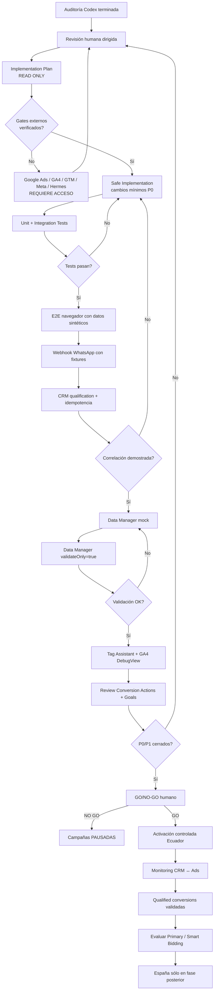

# Plan de acción post-auditoría para Google Ads, GA4, WhatsApp y CRM

## Executive Summary

**Sí: hace falta una revisión humana manual antes de autorizar a Codex a realizar cambios de implementación que afecten atribución, CRM, WhatsApp, consentimiento o Google Ads.** No porque la auditoría automática sea insuficiente —de hecho encontró una base técnica bastante avanzada—, sino porque los principales riesgos están justo en componentes que **el repositorio no puede demostrar por sí solo**: el backend Hermes, el webhook real de Meta/WhatsApp, la configuración Live de GTM, la propiedad GA4, las acciones de conversión de Google Ads, sus objetivos Primary/Secondary, el estado de Enhanced Conversions y el eventual exportador hacia Data Manager API. La auditoría sí demostró problemas locales concretos, entre ellos la incompatibilidad del token reCAPTCHA de Contacto, pérdida de atribución en determinados recorridos, ausencia de first touch real y falta de idempotencia publicitaria demostrable. fileciteturn0file0

La decisión operativa correcta es, por tanto, **no ejecutar aún un prompt amplio de “implementa todo”**. Sí se puede ejecutar inmediatamente el prompt de **Implementation Plan**, porque será de solo lectura y no alterará código. Después se debe hacer una revisión manual dirigida —no una nueva auditoría completa línea por línea— de Google Ads, GA4, GTM, Meta y Hermes. Sólo cuando esos checks estén documentados debe ejecutarse **Safe Implementation**, inicialmente limitado a los fallos locales ya demostrados. Esta cautela es especialmente importante en septiembre de 2026: desde el 15 de junio de 2026 las integraciones nuevas de conversiones offline deben orientarse a **Data Manager API** en lugar de asumir que `UploadClickConversions` seguirá disponible, y Google recomienda Enhanced Conversions for Leads para combinar identificadores publicitarios y datos first-party cuando corresponda. citeturn6search3turn6search7turn1search0

**Estado de salida recomendado hoy, 29 de septiembre de 2026:**

> **Google Ads: NO GO para inversión todavía.**  
> **Implementation Plan: GO ahora.**  
> **Safe Implementation: GO sólo para cambios locales explícitamente aprobados.**  
> **Publicación de GTM / Data Manager / conversiones CRM: NO GO hasta validación humana.**  
> **Campañas Ecuador: mantener en borrador o pausadas.**  
> **España: no activar todavía.**

La auditoría ya demuestra que existe la arquitectura parcial `Google Ads → web → atribución → WhatsApp → Hermes/CRM`, pero no demuestra el tramo crítico `mensaje entrante → correlación → lead cualificado → conversión Google`. Esa diferencia debe gobernar todo el siguiente trabajo. fileciteturn0file0


## Acciones priorizadas

La prioridad no es añadir más tracking, sino **demostrar lo que ya existe, cerrar fallos P0 y evitar duplicar infraestructura**. El informe de Codex ya identifica GTM, captura de `gclid/gbraid/wbraid`, UTMs, Consent Mode, el BFF de atribución, referencias `UC-…`, etapas CRM, hitos comerciales y UI para sincronización; al mismo tiempo, no puede verificar el backend Hermes ni los envíos efectivos a Google. fileciteturn0file0

### P0 — bloquear lanzamiento hasta resolver

| Acción | Qué debe hacerse | Responsable | Esfuerzo | Riesgo | Criterio de aceptación |
|---|---|---:|---:|---:|---|
| **Revisión humana de Hermes** | Abrir el repositorio/servicio/despliegue real de Hermes y comprobar `contact-intents`, persistencia de attribution touch, receptor WhatsApp, asociación contacto/conversación/lead, eventos `LEAD_QUALIFIED`/`CONTRACT_WON`, jobs Google y modo `validateOnly`. La auditoría no pudo acceder a este backend. fileciteturn0file0 | Dev + IT | Alto | Alto | Existe evidencia del flujo completo en staging, con IDs correlacionables, sin inferirlo desde la UI. |
| **Verificar webhook Meta/WhatsApp** | Confirmar callback, suscripción de mensajes, validación del challenge, autenticidad del POST, deduplicación por message ID y procesamiento de la referencia `UC-…`. La auditoría no encontró webhook Meta en el backend local. fileciteturn0file0 | Dev + IT | Medio/alto | Alto | Un fixture firmado aceptado crea exactamente una conversación; replay del mismo mensaje no crea duplicados. |
| **Corregir reCAPTCHA de Contacto** | Frontend manda actualmente `"g-recaptcha-response"` y el backend espera `recaptchaToken`; alinear contrato y añadir test. Es un fallo reproducido por la auditoría. fileciteturn0file0 | Dev | Bajo | Bajo | Formulario válido llega al backend, valida captcha mock, persiste el lead y sólo después devuelve éxito. |
| **No declarar éxito sin persistencia CRM/DB** | `saveLeadToDB` puede fallar y determinados endpoints aún responder success; corregir para que `generate_lead` represente un lead realmente persistido. fileciteturn0file0 | Dev | Bajo/medio | Medio | Si DB falla, HTTP/evento no reportan lead exitoso; si DB persiste, sólo se emite un evento. |
| **Definir qué es “Qualified Lead”** | Documentar regla comercial: datos mínimos, servicio, intención, presupuesto/plazo si corresponde, quién puede cualificar y en qué transición se produce exactamente el evento. No usar el tier `qualified_lead` del chat local como equivalente. fileciteturn0file0 | Marketing + Ventas + Dev | Medio | Alto | Existe una definición escrita y un único evento backend auditable `LEAD_QUALIFIED`. |
| **Diseñar idempotencia antes de Google** | Definir `transactionId` estable por conversión, unique/outbox y política de retry. Data Manager utiliza `transactionId` dentro de una acción para deduplicar y para identificar posteriores ajustes. citeturn7search1turn7search3 | Dev | Medio/alto | Alto | Reprocesar el mismo evento 5 veces genera un único evento lógico/exportación; cambio de valor sólo se trata como ajuste deliberado. |
| **Verificar arquitectura Data Manager** | Confirmar si Hermes ya implementa Data Manager API. No construir un segundo exportador hasta saberlo. Para integraciones nuevas, Data Manager es el camino actual recomendado para offline/Enhanced Conversions for Leads. citeturn6search1turn6search2turn6search3 | Dev + IT | Medio | Alto | Se sabe exactamente qué servicio envía, a qué acción, con qué Cloud project y con qué credenciales. |
| **Establecer un entorno realmente seguro** | Staging/fixtures, CRM no productivo, Meta test o webhook simulado y exportador Google mock/`validateOnly`. | Dev + IT | Medio | Alto | QA puede ejecutar todo el recorrido sin crear lead comercial, mensaje WhatsApp ni conversión Ads real. |

**No ejecutaría `Safe Implementation` antes de terminar como mínimo los P0 de arquitectura externa**, salvo los dos cambios locales inequívocos: **reCAPTCHA** y **“success sólo tras persistencia”**.

### P1 — necesario antes de habilitar campañas

| Acción | Qué debe hacerse | Responsable | Esfuerzo | Riesgo | Criterio de aceptación |
|---|---|---:|---:|---:|---|
| **Auditar GTM Live, no sólo el ID** | Exportar/revisar la versión publicada: Google tag, tags GA4/Ads, triggers, consentimiento, Enhanced Conversions, clics externos, exclusión del área admin y posibles duplicados. El repo sólo demuestra el bootstrap de GTM. fileciteturn0file0 | Dev + Marketing | Medio | Alto | Inventario `evento → trigger → tag → destino` firmado y sin duplicados conocidos. |
| **Comprobar GA4** | Confirmar web stream correcto, eventos, DebugView, key events y eventual importación a Ads. Un `dataLayer.push()` no demuestra recepción en GA4. Google recomienda DebugView/Tag Assistant para validarlo. citeturn10view1turn2search3 | Marketing + Dev | Bajo/medio | Medio | `whatsapp_click`, `generate_lead`, etc. aparecen una sola vez con parámetros previstos y sin PII. |
| **Comprobar objetivos Google Ads** | Revisar acciones, Goals, account-default goals, campaign-specific goals y custom goals. Primary influye en bidding cuando el goal correspondiente está seleccionado; una acción Secondary incluida en un custom goal puede seguir usándose para puja. citeturn0search3turn10view3 | Marketing | Bajo | **Muy alto** | `whatsapp_click` no puede influir accidentalmente en Smart Bidding; queda documentado qué acción sí lo hará. |
| **Mantener nuevas acciones offline como Secondary durante validación** | Google recomienda que una nueva acción de Enhanced Conversions for Leads permanezca Secondary inicialmente durante unas 2–3 semanas mientras se valida. citeturn9view1 | Marketing | Bajo | Bajo | Conversiones visibles en `All conversions`, diagnósticos limpios y comparación CRM↔Ads satisfactoria antes de promoverla. |
| **Implementar first/last touch correctamente** | Separar first touch inmutable y last touch; evitar que una URL parcial elimine `gclid`/UTMs existentes. Añadir `utm_id` si se acuerda. El comportamiento actual sustituye el único touch. fileciteturn0file0 | Dev | Medio | Medio | Tests demuestran first touch estable + last touch actualizado sin borrar campos válidos indebidamente. |
| **Resolver cambios de query SPA** | La auditoría demostró que un `pushState` en la misma ruta puede dejar el click ID anterior. fileciteturn0file0 | Dev | Medio | Medio | Cambio de parámetros de campaña en misma pathname actualiza el touch conforme al contrato. |
| **Revisar pérdida antes de consentimiento** | El flujo `/` etiquetado → otra página → consentir allí puede perder GCLID. Debe diseñarse una solución técnicamente y jurídicamente aceptable; no persistir datos publicitarios antes del consentimiento de manera improvisada. fileciteturn0file0 | Dev + Legal | Medio | Alto | Comportamiento documentado por región y validado con Legal; tests denied/granted. |
| **Unificar consentimiento** | Misma policy version, reapertura de ajustes y revocación consistente Google/Meta en estática y React. Google recomienda comprobar en Tag Assistant el default y los updates de `ad_storage`, `analytics_storage`, `ad_user_data` y `ad_personalization`. citeturn10view0turn2search0 | Dev + Legal | Medio | Alto UE | Tag Assistant muestra estados correctos antes y después de aceptar/denegar/revocar. |
| **Preparar first-party data correctamente** | Decidir si Enhanced Conversions utilizará email/teléfono y dónde se normalizarán/hashearán. Data Manager exige formatos específicos; teléfono E.164, SHA-256 y normalización de email según la guía. citeturn1search4 | Dev + Legal | Medio | Alto | Tests con vectores conocidos de normalización; valores originales nunca aparecen en logs de exportación. |
| **Definir moneda y valor** | Ecuador será USD; España previsiblemente EUR. No mezclar contrato, revenue recibido y expected value. La auditoría detectó fallbacks USD/EUR diferentes. fileciteturn0file0 | Marketing + Finanzas + Dev | Bajo/medio | Medio | Cada evento monetario lleva ISO currency explícita y significado documentado. |
| **Reconciliar formularios/pagos con Hermes** | Determinar sistema de registro autoritativo y evitar CRM paralelo que no contenga attribution IDs. fileciteturn0file0 | Dev | Medio/alto | Alto | Lead de formulario/pago puede trazarse a un único contacto CRM y touch cuando existe. |

### P2 — tras tener medición estable

P2 debe ocuparse de observabilidad, reconciliación y calidad, no de alterar automáticamente las pujas. Hay que añadir métricas de intenciones WhatsApp que fallan, alinear timeouts cliente/BFF, reconciliar Calendly con reuniones CRM, revisar rate limiting en despliegues con varias réplicas y comprobar campañas/costes contra Google. Todos estos problemas están ya identificados en el informe. fileciteturn0file0

También conviene evaluar `sessionAttributes` cuando no haya GCLID/WBRAID o como señal complementaria: Data Manager los soporta y documenta expresamente como alternativa/complemento para mejorar atribución. No lo añadiría en P0 porque primero hay que estabilizar el flujo que ya existe. citeturn7search6

### P3 — optimización avanzada

Sólo después de acumular resultados comerciales fiables introduciría **puja por valor**, expected value por tipo de servicio, cierre/margen, ajustes posteriores de valor y atribución multisesión. Data Manager admite conversion value, currency y ajustes mediante el mismo `transactionId`, pero una actualización del mismo ID puede convertirse en un ajuste de la conversión existente; por ello esta capa requiere datos comerciales sólidos y una política explícita. citeturn6search2turn7search3


## Verificaciones externas

Todos los elementos de esta sección están marcados **REQUIERE ACCESO**. No puedo comprobar su estado desde el repositorio ni desde la auditoría suministrada. fileciteturn0file0

### Google Ads

| Verificación | Pasos exactos | Captura/output esperado | Estado |
|---|---|---|---|
| **Auto-tagging** | Google Ads → **Administrador → Configuración de la cuenta → Etiquetado automático** → comprobar “Etiquetar la URL de destino de mi anuncio”. Google indica que las cuentas nuevas suelen traerlo activado, pero debe verificarse. citeturn9view0 | Captura donde se vea la casilla activada + Customer ID parcialmente oculto. | **REQUIERE ACCESO** |
| **Preservación del GCLID** | Con auto-tagging confirmado, probar una landing con parámetros arbitrarios y sus redirecciones. Google exige que redirects preserven GCLID. citeturn9view0turn0search1 | DevTools/URL final mostrando que query parameters no desaparecen. | **REQUIERE ACCESO** |
| **Listado de Conversion Actions** | **Goals → Conversions → Summary**. Inventariar nombre, source, category, status, count, value y owner. | Captura completa de tabla, ocultando IDs sensibles cuando proceda. Deben poder identificarse por separado `WhatsApp Click`, `Qualified Lead`, `Converted Lead/Contract Won`, etc., si existen. | **REQUIERE ACCESO** |
| **Primary / Secondary** | Abrir cada Goal → Edit → **Conversion action optimization**. Google permite Primary o Secondary. citeturn10view3 | Captura de cada acción con Primary/Secondary. | **REQUIERE ACCESO** |
| **Account-default goals** | Goals → Conversions → Goals → “All your goals” → Edit → **Account default**. citeturn10view3 | Captura donde se vea cuáles están incluidos como account-default. | **REQUIERE ACCESO** |
| **Goals de cada campaña** | Abrir configuración de cada campaña → goals usados para bidding. Revisar también custom goals. Una Secondary puede acabar utilizándose para puja si está en un custom goal. citeturn0search3 | Captura por campaña con goals seleccionados. | **REQUIERE ACCESO** |
| **Enhanced Conversions** | Goals → Conversions → Settings/Summary → comprobar el interruptor unificado vigente en 2026. Desde abril de 2026 Google unificó Enhanced Conversions web/leads en un único setting. citeturn9view1 | Captura del estado activado/desactivado y fuente de datos. | **REQUIERE ACCESO** |
| **Customer Data Terms** | Goals → Settings → junto a **Customer data terms** → View Terms. Estado esperado una vez jurídicamente aprobado: **Accepted**. citeturn10view4 | Captura “Accepted”; no aceptar sin autorización empresarial/legal. | **REQUIERE ACCESO** |
| **Enhanced Conversions diagnostics** | Goals → Conversions → Summary → **Diagnostics → View Diagnostics**. citeturn9view1 | Captura de errores/warnings/match diagnostics. | **REQUIERE ACCESO** |
| **Cuenta propietaria de conversiones** | Confirmar si las conversiones las posee la cuenta Ads o un MCC con cross-account conversion tracking. | Customer ID owner de cada acción + login/manager account documentados. | **REQUIERE ACCESO** |

Google recomienda acciones únicas para cada evento offline como **Qualified Lead** y **Converted Lead**, y para lead generation recomienda precisamente las categorías Qualified/Converted Lead en lugar de convertir un clic superficial en la señal comercial principal. citeturn9view1turn10view4

### GA4 y GTM

| Verificación | Pasos exactos | Captura/output esperado | Estado |
|---|---|---|---|
| **Ads ↔ GA4** | Google Ads → Tools → **Data Manager → Connect Product → Google Analytics (GA4) & Firebase**, o comprobar conexión existente. Requiere Admin Ads y Edit en GA4. citeturn10view2 | Propiedad GA4 correcta vinculada a la cuenta Ads correcta. | **REQUIERE ACCESO** |
| **Web stream GA4** | GA4 → Admin → Data Streams → Web. Confirmar dominio, Measurement ID y enhanced measurement. | Captura de stream sin exponer información privada innecesaria. | **REQUIERE ACCESO** |
| **Eventos GA4** | Usar Tag Assistant y luego GA4 → Admin → Data display → **DebugView**. citeturn10view1 | Un solo `whatsapp_click`, `generate_lead`, `schedule_complete`, etc. por acción; parámetros esperados. | **REQUIERE ACCESO** |
| **PII en GA4** | Inspeccionar parámetros de cada evento en DebugView/Network y GTM variables. | Ningún email, teléfono, nombre, `wa_id` identificable, texto libre sensible o equivalente en parámetros ordinarios de GA4. | **REQUIERE ACCESO** |
| **GTM Live** | GTM → Versions → identificar versión **Live** → exportar JSON para revisión técnica. | JSON/version ID con Google tag, eventos, Consent settings y triggers. | **REQUIERE ACCESO** |
| **Duplicados** | GTM Preview/Tag Assistant → efectuar exactamente un clic/form submit. | Cada tag relevante dispara una sola vez; no hay GA4-import + Ads-tag duplicando la misma acción por error. | **REQUIERE ACCESO** |
| **Consent Mode** | Tag Assistant → sesión nueva → inspeccionar primer `Consent` event y último tras interactuar. Deben comprobarse los cuatro estados. citeturn10view0 | Capturas **On-page Default** y **On-page Update** para `ad_storage`, `analytics_storage`, `ad_user_data`, `ad_personalization`. | **REQUIERE ACCESO** |
| **Denegación/revocación** | Repetir sesión: Reject all; posteriormente cambiar preferencias. | Tags se comportan según política; no queda un estado antiguo inconsistente. | **REQUIERE ACCESO** |

### Data Manager API

Ésta es una revisión esencial en 2026. Desde el 15 de junio de 2026 las integraciones nuevas de cargas offline no deben diseñarse suponiendo acceso nuevo a `UploadClickConversions`; Google orienta la migración a Data Manager API. citeturn6search3turn6search7

| Verificación | Pasos exactos | Output esperado | Estado |
|---|---|---|---|
| **Google Cloud project** | Cloud Console/IAM: identificar proyecto responsable. | Project ID documentado; sin claves privadas copiadas al informe. | **REQUIERE ACCESO** |
| **API habilitada** | APIs & Services → comprobar **Data Manager API** enabled. Google exige habilitarla explícitamente. citeturn6search0 | Estado Enabled. | **REQUIERE ACCESO** |
| **Credenciales** | Revisar usuario/service account y scopes. Data Manager requiere scope `datamanager`; Google recomienda métodos sin service-account keys persistentes cuando sea posible. citeturn6search0 | Identidad operativa + roles/scopes documentados, secretos ocultos. | **REQUIERE ACCESO** |
| **Destination** | Confirmar operating account, linked account si aplica, `productDestinationId` y conversion action real. Data Manager define estos elementos mediante `Destination`. citeturn1search7 | JSON/config redacted mostrando IDs estructurales correctos. | **REQUIERE ACCESO** |
| **Dry run** | Construir un fixture aprobado y enviar `validateOnly=true`. Google lo documenta precisamente para validar sin aplicar cambios. citeturn0search5 | HTTP éxito de validación o error de esquema a corregir; **ninguna conversión aplicada**. | **REQUIERE ACCESO** |
| **Diagnósticos reales** | Sólo después de autorización para un evento legítimo: capturar `request_id` y consultar `RetrieveRequestStatus`. Los requests `validateOnly=true` no generan diagnósticos recuperables. citeturn10view5 | `SUCCESS`, `PARTIAL_SUCCESS` o `FAILURE` + warnings/error counts. | **REQUIERE ACCESO** |
| **transactionId** | Comprobar que cada evento tiene un ID estable conforme al negocio. | Ej.: qualified lead y contrato usan IDs deterministas distintos según la semántica definida. | **REQUIERE ACCESO** |
| **Datos first-party** | Revisar normalización → SHA-256 → encoding; GCLID/BRAID preservados cuando existan. citeturn1search4turn7search1 | Tests unitarios con hashes conocidos; payload sin PII sin hash donde deba ir hasheada. | **REQUIERE ACCESO** |

Un punto crítico: **`validateOnly=true` sirve para validar una solicitud pero no debe confundirse con un envío real satisfactorio**. Google sólo permite recuperar diagnósticos posteriores de solicitudes exitosas que no sean `validateOnly`; un envío real devuelve `request_id` y posteriormente puede alcanzar `SUCCESS`, `PARTIAL_SUCCESS` o `FAILURE`. citeturn10view5

### Meta / WhatsApp Business

| Verificación | Pasos | Evidencia esperada | Estado |
|---|---|---|---|
| **WABA y número** | Meta Business / WhatsApp Manager: comprobar WABA, número de producción y Phone Number ID asociado a la app correcta. | Captura con IDs parcialmente ocultos y estado operativo. | **REQUIERE ACCESO** |
| **App Meta** | Confirmar que es la app que utiliza el asistente/CRM productivo. | App ID parcialmente oculto y WABA asociado. | **REQUIERE ACCESO** |
| **Webhook callback** | Meta Developers → app → WhatsApp/Webhooks → revisar Callback URL y suscripción. | Callback apuntando al backend correcto de Hermes/servicio receptor. | **REQUIERE ACCESO** |
| **Handshake** | Verificar que un GET válido devuelve el `hub.challenge` sólo cuando coincide el verify token. La documentación oficial del SDK de Meta describe ese flujo. citeturn4search0turn4search6 | Test automatizado 200/challenge correcto; token incorrecto rechazado. | **REQUIERE ACCESO** |
| **Firma del webhook** | Comprobar validación de `x-hub-signature-256` usando App Secret antes de procesar POST. La referencia oficial del SDK Meta exige payload validado. citeturn4search0turn4search3 | Fixture con firma válida → 200; payload alterado → rechazo. | **REQUIERE ACCESO** |
| **Suscripción messages** | Confirmar que la aplicación está suscrita a los eventos que procesa el asistente. | Evento test aparece en log/queue de staging una vez. | **REQUIERE ACCESO** |
| **Permisos token** | Revisar token/identidad operativa y permisos necesarios; la colección oficial de Meta en Postman documenta `whatsapp_business_messaging` para operaciones Cloud API. citeturn4search16 | Token debugger/config redacted mostrando permisos, sin copiar token. | **REQUIERE ACCESO** |
| **Idempotencia message ID** | Reinyectar el mismo fixture dos o más veces. | Una sola fila de mensaje/evento de negocio. | **REQUIERE ACCESO** |
| **Referencia UC** | Fixture inbound con `Referencia: UC-TEST...`. | Se resuelve exactamente al contact-intent sintético correspondiente. | **REQUIERE ACCESO** |
| **Referencia inválida/expirada** | Repetir con referencia inexistente/expirada/ya consumida. | No se reasigna atribución a otro lead; resultado controlado y auditable. | **REQUIERE ACCESO** |


## Prompts listos para Codex

### Modelo recomendado

Para estas dos fases usaría **GPT-5.6 Sol con reasoning `high`, modo estándar**. OpenAI posiciona GPT-5.6 Sol como modelo flagship para trabajo profesional complejo; admite `high`, `xhigh` y `max`, herramientas de shell y patching, y OpenAI recomienda `high` para debugging complejo, planificación profunda y tareas agentic de alto valor. `xhigh` lo reservaría para una segunda auditoría del backend Hermes/idempotencia si aparecen contradicciones; `max` no lo usaría por defecto. citeturn8search0turn8search1turn8search2

| Tarea | Modelo | Reasoning | Escritura |
|---|---|---|---|
| Implementation Plan | **GPT-5.6 Sol** | **High** | Sólo documentación |
| Safe Implementation fase local | **GPT-5.6 Sol** | **High** | Sólo archivos allowlisted |
| Revisión Hermes compleja | **GPT-5.6 Sol** | **xHigh** si High deja dudas | Preferiblemente inicialmente read-only |

### Prompt de Implementation Plan

Este prompt **sí puede ejecutarse ahora**.

```text
Actúa como Principal Tracking Engineer + Staff Backend Engineer especializado en
Google Ads, GA4, GTM, Consent Mode, WhatsApp Business Platform, CRM attribution,
Enhanced Conversions for Leads y Google Data Manager API.

CONTEXTO

Existe una auditoría previa en:

docs/google-ads-tracking-audit.md

La auditoría fue realizada antes de implementar cambios.

Tu tarea NO es volver a hacer la auditoría completa y NO es modificar la aplicación.

OBJETIVO

Convertir esa auditoría en un Implementation Plan ejecutable, seguro y dividido
en fases, preservando todo lo que ya funciona.

REGLAS DE SEGURIDAD

1. NO modificar código fuente.
2. NO ejecutar migraciones.
3. NO modificar .env.
4. NO modificar credenciales.
5. NO publicar GTM.
6. NO modificar Google Ads/GA4/Meta.
7. NO enviar mensajes WhatsApp.
8. NO crear leads productivos.
9. NO enviar conversiones Google.
10. NO asumir que la UI de Hermes demuestra que el backend existe.
11. NO crear un segundo exportador Google antes de comprobar si Hermes ya tiene uno.
12. NO convertir whatsapp_click en la conversión de optimización principal.
13. No imprimir secretos ni PII.

PUEDES

- leer todo el repositorio;
- ejecutar búsquedas;
- ejecutar tests no destructivos;
- inspeccionar git;
- consultar documentación oficial si tienes acceso web;
- crear únicamente:
  docs/google-ads-implementation-plan.md

FUENTE PRINCIPAL

Lee íntegramente:
docs/google-ads-tracking-audit.md

Verifica las referencias de archivos del informe contra el código actual.
Si el código cambió desde la auditoría, indícalo explícitamente.

CONTEXTO GOOGLE 2026

Contrasta, cuando haya acceso web, únicamente documentación oficial actual sobre:

- Google Ads auto-tagging
- conversion actions y goals
- Primary/Secondary
- Enhanced Conversions / Enhanced Conversions for Leads
- Consent Mode
- Data Manager API
- offline conversions
- transactionId / deduplication
- diagnostics
- GA4 / Google Ads linking

Ten presente que desde junio de 2026 no debe diseñarse una integración NUEVA
suponiendo acceso nuevo a UploadClickConversions. Prioriza Data Manager API si
realmente hace falta construir/migrar el exportador.

FASE DE ANÁLISIS

Reclasifica cada hallazgo como:

A. Confirmado localmente y seguro de corregir.
B. Requiere inspección del backend Hermes.
C. Requiere acceso Google Ads.
D. Requiere acceso GTM.
E. Requiere acceso GA4.
F. Requiere acceso Meta/WhatsApp.
G. Requiere revisión de privacidad/legal.
H. No requiere cambio.

P0

Presta especial atención a:

- contrato reCAPTCHA Contacto frontend/backend;
- éxito HTTP aunque saveLeadToDB falle;
- backend Hermes no auditado;
- contact-intent → reference → mensaje inbound → lead;
- webhook Meta y validación de firma;
- definición real de LEAD_QUALIFIED;
- idempotencia;
- outbox;
- exportador Google;
- Data Manager;
- validateOnly;
- estado Unknown vs "sync disabled".

P1

Analiza:

- first touch;
- last touch;
- utm_id;
- query-only navigation;
- pérdida preconsentimiento;
- Consent Mode;
- revocación;
- GTM/GA4;
- Enhanced Conversions;
- normalización/hash;
- moneda;
- integración de leads/pagos locales con Hermes.

PARA CADA CAMBIO PROPUESTO

Incluye:

ID
PRIORIDAD
PROBLEMA
EVIDENCIA
ARCHIVOS
CAMBIO MÍNIMO
CAMBIO IDEAL FUTURO
DEPENDENCIAS
RESPONSABLE
RIESGO
TESTS
ROLLBACK
CRITERIO DE ACEPTACIÓN
BLOQUEADO POR ACCESO EXTERNO: sí/no

MUY IMPORTANTE

No propongas "implementar Data Manager" simplemente porque no aparece en este
repo.

Primero debes colocar:

GATE-HERMES-01:
"Comprobar si Hermes ya dispone de exportador Data Manager/Google".

Si existe:
proponer revisar/completar.

Si no existe:
proponer una implementación.

Lo mismo para webhook Meta y Enhanced Conversions.

ORDEN DEL PLAN

Quiero fases pequeñas:

Phase A — External Read-Only Verification
Phase B — Deterministic Local P0 Fixes
Phase C — Attribution Contract
Phase D — WhatsApp/CRM Correlation
Phase E — Qualification and Idempotency
Phase F — Google Feedback / Data Manager
Phase G — Consent / Enhanced Conversions
Phase H — Final Pre-Launch QA

Para cada fase especifica:

preconditions
allowed files
forbidden files
tests before
implementation steps
tests after
rollback
definition of done

CREA TAMBIÉN UNA MATRIZ DE GATES

Ejemplo:

GATE | OWNER | EVIDENCE REQUIRED | PASS/FAIL/UNKNOWN | BLOCKS

Gates mínimos:

- Google Ads auto-tagging
- Ads↔GA4
- GTM Live
- Conversion Actions
- Primary/Secondary
- Custom Goals
- Customer Data Terms
- Enhanced Conversions
- Hermes contact-intent
- Meta webhook
- QUALIFIED transition
- Data Manager implementation
- validateOnly support
- outbox/idempotency
- Consent Mode
- PII protection

SALIDA

Crear únicamente:

docs/google-ads-implementation-plan.md

No modificar ningún otro archivo.

Al terminar, imprimir:

PLAN_CREATED
SOURCE_FILES_MODIFIED=0
EXTERNAL_GATES_REQUIRED=<número>
SAFE_LOCAL_CHANGES_IDENTIFIED=<número>
READY_FOR_HUMAN_REVIEW
```

### Prompt de Safe Implementation

Este prompt **no debe ejecutarse todavía sobre todo el plan**. Debe usarse después de la revisión humana y, en primera ejecución, limitarse a los fallos locales inequívocos.

```text
Actúa como Staff Software Engineer ejecutando una implementación de alto riesgo
con change control estricto.

Lee primero:

docs/google-ads-tracking-audit.md
docs/google-ads-implementation-plan.md

OBJETIVO DE ESTA EJECUCIÓN

Implementar ÚNICAMENTE estos cambios aprobados:

APPROVED_CHANGE_IDS:
- FIX-RECAPTCHA-CONTRACT
- FIX-LEAD-PERSISTENCE-BEFORE-SUCCESS

Si los IDs anteriores no existen en el plan o su evidencia no coincide con el
código actual:

DETENTE SIN MODIFICAR CÓDIGO.

NO amplíes el scope.

PERMISOS

Puedes modificar únicamente los archivos que el Implementation Plan haya
identificado para esos dos cambios y sus tests relacionados.

En principio el alcance esperado debería limitarse a piezas equivalentes a:

- src/components/Contact/Form.jsx
- backend/server.js
- tests específicos de Contact/Form/backend

Pero usa la allowlist EXACTA del plan como fuente de verdad.

PROHIBIDO

- modificar attribution;
- modificar Consent Mode;
- modificar GTM;
- añadir Google Ads tags;
- añadir Google Ads API;
- añadir Data Manager API;
- cambiar Hermes;
- cambiar webhook Meta;
- modificar .env;
- modificar secrets;
- ejecutar migraciones productivas;
- enviar WhatsApp;
- crear leads productivos;
- llamar Google Ads en modo real;
- cambiar configuración de campañas;
- refactorizaciones no relacionadas;
- limpiar código legacy;
- actualizar dependencias sin necesidad.

PROCEDIMIENTO

1. git status
2. registrar archivos ya modificados por el usuario
3. NO sobrescribir cambios preexistentes
4. ejecutar tests relevantes antes
5. aplicar el parche mínimo
6. añadir/ajustar tests
7. ejecutar tests unitarios relevantes
8. ejecutar suite más amplia si es segura
9. mostrar git diff
10. revisar el diff buscando cambios fuera de scope

FIX-RECAPTCHA-CONTRACT

Criterio:

- frontend y backend usan el mismo nombre/campo contractual;
- token ausente/inválido falla de forma controlada;
- token válido mock permite continuar;
- no imprimir token;
- no reducir seguridad;
- no hacer bypass de captcha en producción.

FIX-LEAD-PERSISTENCE-BEFORE-SUCCESS

Criterio:

- si la persistencia falla, el endpoint no afirma lead exitoso;
- no se dispara un evento de éxito cliente como consecuencia de una falsa
  respuesta success;
- si persistencia funciona, sólo existe un lead lógico;
- conservar el comportamiento de correo sólo cuando sea coherente con la
  semántica acordada;
- tests de fallo y éxito.

NO IMPLEMENTAR

Aunque los veas en el informe:

- first/last touch;
- utm_id;
- Enhanced Conversions;
- Data Manager;
- webhook;
- idempotencia Google;
- cambios Consent Mode.

Esos serán change sets independientes.

SALIDA

Al finalizar proporciona:

FILES_CHANGED
TESTS_BEFORE
TESTS_AFTER
DIFF_SUMMARY
KNOWN_LIMITATIONS
ROLLBACK_STEPS
OUT_OF_SCOPE_FINDINGS

Termina exactamente con:

SAFE_CHANGESET_COMPLETE
NO_EXTERNAL_SYSTEMS_MODIFIED
```

La razón de fragmentarlo así es reducir el riesgo de que un único agente mezcle arreglos web relativamente triviales con cambios de privacidad, CRM, Meta y Google Ads que tienen efectos comerciales. Es especialmente recomendable en este proyecto porque la auditoría ya demostró que varias piezas visibles son **contratos/UI hacia Hermes**, no el backend ejecutor. fileciteturn0file0


## Plan de pruebas y QA

### Pirámide de pruebas

La primera capa debe ser totalmente local y determinista; la segunda, staging con servicios mock; la tercera, herramientas de diagnóstico de Google/Meta; y sólo finalmente, eventos comerciales legítimos en producción. Google ofrece `validateOnly=true` precisamente para comprobar solicitudes de Data Manager sin aplicarlas. citeturn0search5

| Nivel | Qué se valida | Sistemas reales | Resultado esperado |
|---|---|---|---|
| Unit | parsing, consentimiento, first/last, hashing, IDs | Ninguno | Determinista |
| Integration | BFF ↔ Hermes fake, formulario ↔ DB fake | Ninguno/productivo | Determinista |
| Browser E2E | navegación, sessionStorage, dataLayer, WhatsApp URL | GTM/Meta bloqueados | Determinista |
| Webhook fixture | firma, replay, correlación UC | Hermes staging/mock | Determinista |
| Data Manager dry run | esquema/destination/auth | Google, `validateOnly=true` | Sin conversión aplicada |
| Tag QA | GTM/GA4/Consent | Google real de diagnóstico | Sólo telemetría de QA |
| Production validation | lead legítimo real | Sistemas reales | Última fase |

### URLs sintéticas

Mantendría una suite con, como mínimo:

```text
/?gclid=TEST_GCLID_001
&utm_source=google
&utm_medium=cpc
&utm_campaign=qa_ecuador
&utm_id=qa_001
&utm_term=software_a_medida
&utm_content=search_ad_a
```

Y casos separados para:

```text
/?gbraid=TEST_GBRAID_001&utm_source=google&utm_medium=cpc
```

```text
/?wbraid=TEST_WBRAID_001&utm_source=google&utm_medium=cpc
```

Los IDs sintéticos son adecuados para probar **tu aplicación** y nunca deben enviarse como conversiones reales a Google.

### Casos E2E mínimos

| Caso | Secuencia | Aceptación |
|---|---|---|
| Consent denied | URL etiquetada → Reject → navegar → WhatsApp | No se persisten/envían identificadores publicitarios fuera del comportamiento aprobado. |
| Consent granted | URL etiquetada → Accept → navegar 3 páginas → WhatsApp | Touch esperado continúa disponible. |
| Consent tardío | URL etiquetada → otra página → Accept | Resultado coincide con la política definida; hoy la auditoría demuestra pérdida en este caso. fileciteturn0file0 |
| First touch | campaña A → campaña B | First=A y no cambia. |
| Last touch | campaña A → campaña B | Last=B. |
| URL sin campaña | campaña A → navegación directa | No destruye A arbitrariamente. |
| Query-only | `/landing?gclid=A` → `pushState(...gclid=B)` | Política actualizada captura B si ése es el contrato. |
| Reload | recargar página | No crea conversiones nuevas. |
| WhatsApp 1 clic | un click normal | 1 `whatsapp_click`, 1 contact-intent máximo. |
| WhatsApp doble clic | doble click rápido | No genera duplicado accidental. |
| BFF timeout | Hermes tarda | Contacto puede continuar según fallback, pero se registra diagnóstico técnico sin PII. |
| Form DB failure | captcha OK → DB error | No `generate_lead` success. |
| Form DB success | captcha OK → DB OK | 1 lead, 1 success, 1 evento. |

### Webhook WhatsApp sin mensajes reales

En staging, el receptor debe aceptar un raw body sintético y una firma HMAC generada con un **secret de prueba**, nunca el App Secret real. La suite debe contener al menos: firma correcta, firma incorrecta, body modificado después de firmar, mensaje repetido con mismo message ID, referencia válida, referencia expirada y referencia consumida. La documentación oficial de Meta exige validar el POST antes de responder/procesarlo. citeturn4search0turn4search3

El test crítico debe ser:

```text
mismo Meta message_id enviado 5 veces
        ↓
1 mensaje persistido
1 resolución de referencia
1 contacto/conversación
máximo 1 transición de negocio
0 conversiones duplicadas
```

### Prueba de idempotencia CRM → Google

No basta con deshabilitar botones en frontend. Debe probarse concurrencia y retries en backend:

```text
LEAD_123 pasa a QUALIFIED
event_id = lead:123:qualified:v1
transaction_id = lead_123_qualified
```

Ejecutar simultáneamente:

```text
worker A
worker B
reintento A
reintento B
replay manual
```

Aceptación:

```text
business_event rows       = 1
outbox logical event      = 1
successful delivery       <= 1
stable transaction_id     = sí
```

Data Manager utiliza `transactionId` como identificador único de conversión/deduplicación dentro de una acción. Si se vuelve a utilizar el mismo ID con un valor actualizado, puede interpretarlo como un ajuste, por lo que un retry accidental **no debe cambiar campos monetarios**. citeturn7search1turn7search3

### Data Manager sin crear conversiones reales

El orden correcto sería:

```text
Mock local
↓
contract test
↓
Google Data Manager validateOnly=true
↓
PASS
↓
STOP
```

No se debe poner `validateOnly=false` durante QA sintético. Google documenta que `validateOnly=true` valida sin aplicar cambios. citeturn0search5

Cuando posteriormente exista un evento comercial auténtico y autorizado, la prueba productiva puede generar un `request_id`; después se consultan diagnósticos hasta obtener `SUCCESS`, `PARTIAL_SUCCESS` o `FAILURE`. citeturn10view5

### GA4 / GTM

Con Tag Assistant habilitado, una acción debe verse una vez en el timeline y luego en DebugView. GA4 DebugView permite ver eventos y parámetros de un dispositivo de debug; con Consent Mode y analytics denegado es normal que determinados eventos no aparezcan. citeturn10view1

La hoja de QA debería contener:

| Acción humana | dataLayer | GA4 | Ads web conversion | CRM | Offline |
|---|---:|---:|---:|---:|---:|
| Abrir página | según config | page_view | No | No | No |
| Clic WhatsApp | 1 | 1 | Secondary/según diseño | intent | No |
| Mensaje inbound | No necesariamente | Opcional | No | conversación | No |
| Lead creado | según diseño | opcional | Secondary | Sí | No |
| Qualified | backend | opcional | **offline quality signal** | Sí | Sí posteriormente |
| Contract Won | backend | opcional | offline sale/value | Sí | Sí posteriormente |

El principio es sencillo: **un único hecho comercial no debe transformarse accidentalmente en dos conversiones Primary distintas**.


## Matriz de comunicación y gobernanza

Antes del lanzamiento no todos los equipos necesitan la misma información.

| Receptor | Qué debe recibir | Qué NO necesita recibir | Responsable de aprobar |
|---|---|---|---|
| **Desarrollo** | Audit `.md`, Implementation Plan, arquitectura actual/objetivo, contrato de eventos, esquema attribution, gates externos, tests, allowlist de archivos, rollback. | Presupuesto publicitario detallado si no afecta implementación. | Tech Lead |
| **Marketing/Ads** | Lista de conversion actions, Primary/Secondary, goals por campaña, definición de Qualified, moneda, ventanas/attribution settings, GA4↔Ads, estado de diagnósticos y fecha de activación. | Secretos, tokens, hashes de clientes, implementación interna del webhook. | Responsable Google Ads |
| **Ventas/CRM** | Definición exacta de NEW/CONTACTED/QUALIFIED/PROPOSAL/WON, cuándo registrar valor, moneda, contract ID y cuándo NO mover una etapa. | GCLID técnico completo salvo necesidad operativa. | Sales owner |
| **Legal/Privacidad** | Datos recogidos, finalidad, Consent Mode, campos enviados a Google/Meta, retención, revocación, Ecuador vs España/EEE y Customer Data Terms. | Lógica irrelevante del frontend. | Responsable legal/privacidad |
| **IT/Security** | Cloud project, service identity, scopes, secrets manager, webhook signature, rate limiting, logging, outbox, alerts, backups y permisos. | Estrategia de keywords. | IT/Security |
| **Dirección** | GO/NO GO, P0 abiertos, coste previsto, qué señal optimizará Ads y definición de lead rentable. | Detalles de GTM/debugging. | Business owner |

### Documento que Marketing debe firmar antes del lanzamiento

No hace falta un documento jurídico complejo; una hoja de control es suficiente:

| Campo | Valor previo al lanzamiento |
|---|---|
| País inicial | **Ecuador** |
| España | **PAUSADO / posterior** |
| Conversión micro: WhatsApp click | Secondary |
| Conversation started | Secondary inicialmente |
| Form lead | Secondary inicialmente |
| Qualified Lead | Secondary durante validación; candidato Primary tras QA |
| Contract Won | Medición obligatoria; estrategia de bidding posterior |
| Acción que realmente usa la campaña para pujar | **Debe estar explícitamente escrita** |
| Moneda Ecuador | USD |
| Moneda España | EUR cuando se lance |
| Definición Qualified | **No especificada todavía — debe cerrarse** |
| Valor de Qualified Lead | **No especificado** |
| Presupuesto inicial | **No especificado** |
| CPA objetivo | **No especificado** |
| Dueño de Google Ads | **No especificado** |
| Dueño técnico de Hermes | **No especificado** |

Google recomienda que, cuando hay varias etapas del mismo embudo, no se conviertan indiscriminadamente todas en objetivos account-default; el objetivo debe representar la acción de negocio que realmente se quiere optimizar. citeturn0search3


## Lanzamiento seguro y flujo operativo

### Qué hacer ahora para no gastar presupuesto

**Mantener todas las campañas en estado Paused o todavía sin publicar.** Google confirma que pausar una campaña impide que sus anuncios se publiquen; no conviene usar “Remove” como mecanismo temporal porque eliminar una campaña es permanente. citeturn11search3

Mientras se trabaja en medición:

1. Crear estructura, keywords, anuncios y assets en borrador/pausado.
2. Mantener **Ecuador** como único mercado preparado para la primera activación.
3. Crear España separadamente, pero dejarla pausada hasta completar revisión de consentimiento/EEE.
4. Mantener `whatsapp_click`, `schedule_open`, `schedule_complete` y otras microconversiones como **Secondary**.
5. Mantener también las nuevas conversiones offline de calidad en Secondary durante su fase inicial de validación; el checklist vigente de Enhanced Conversions for Leads de Google recomienda 2–3 semanas inicialmente como Secondary. citeturn9view1
6. Revisar que ningún **custom goal** vuelva biddable accidentalmente una acción Secondary. Google advierte expresamente que esto puede ocurrir. citeturn0search3
7. No activar Smart Bidding hacia `whatsapp_click`.
8. No habilitar un exportador Data Manager real hasta haber pasado `validateOnly`.
9. No usar datos sintéticos como conversiones productivas.
10. No lanzar España hasta que la estrategia de consentimiento y first-party data tenga revisión específica de EEE.

### No confiar en un presupuesto bajo como freno de seguridad

Cuando se active finalmente una campaña, debe tener un presupuesto conservador, pero **el presupuesto diario medio no es un límite rígido de gasto de ese día**. Para la mayoría de las campañas Google puede gastar hasta 2 veces el presupuesto diario medio en un día concreto, mientras aplica un límite mensual equivalente, por lo general, a 30,4 veces dicho presupuesto. Por ello, el control previo al lanzamiento debe ser **estado Paused**, no simplemente “poner un presupuesto muy pequeño”. citeturn11search0turn11search8

Como el usuario no ha indicado todavía presupuesto, **no fijaría una cifra arbitraria en USD**. Esa cifra debe decidirse cuando se cierre la estrategia de campaña y exista al menos un rango de ticket, margen, tasa de cierre y CPA tolerable.

### Gate de lanzamiento recomendado

La transición debería ser binaria:

| Gate | Condición | Resultado si falla |
|---|---|---|
| G1 | reCAPTCHA y formularios correctos | NO GO |
| G2 | Hermes revisado | NO GO |
| G3 | referencia WhatsApp correlaciona CRM | NO GO |
| G4 | webhook autenticado + idempotente | NO GO |
| G5 | definición Qualified aprobada | NO GO |
| G6 | GTM Live auditado | NO GO |
| G7 | GA4 DebugView correcto | NO GO |
| G8 | Ads auto-tagging correcto | NO GO |
| G9 | Conversion Actions/Goals correctos | NO GO |
| G10 | Consent Mode validado | NO GO |
| G11 | Customer Data Terms/Legal aprobados si se usan first-party data | NO GO |
| G12 | Data Manager mock + `validateOnly` pasa | NO GO para offline uploads |
| G13 | QA E2E sin duplicados | NO GO |
| G14 | Campaigns/geo/budget revisados por Marketing | **GO Ecuador** |

### Flujo de trabajo post-auditoría



### Flujo técnico que debe quedar demostrado

```mermaid
flowchart LR
    ADS["Google Ads<br/>auto-tagging"] --> WEB["Landing"]
    WEB --> CONSENT["Consentimiento"]
    CONSENT --> ATTR["First + Last Touch<br/>GCLID/BRAIDs/UTMs"]

    ATTR --> CTA["WhatsApp CTA<br/>Secondary"]
    CTA --> INTENT["Hermes Contact Intent"]
    INTENT --> REF["Referencia UC"]
    REF --> WA["WhatsApp"]

    WA --> META["Webhook Meta<br/>firma verificada"]
    META --> DEDUP["Dedup message_id"]
    DEDUP --> CORR["Resolver referencia"]
    CORR --> CRM["Contact + Conversation + Lead"]

    CRM --> QUAL["QUALIFIED"]
    CRM --> PROP["Proposal / Opportunity"]
    CRM --> WON["CONTRACT WON"]

    QUAL --> OUTBOX["Outbox idempotente"]
    PROP --> OUTBOX
    WON --> OUTBOX

    OUTBOX --> ELIG["Consent + eligibility<br/>normalización/hash"]
    ELIG --> DM["Data Manager API"]
    DM --> GADS["Google Ads<br/>Conversion Actions"]

    GADS --> REPORT["Diagnostics + reporting"]
    REPORT --> BID["Bidding<br/>sólo señal aprobada"]
```



El cambio conceptual más importante es que **Google Ads no debe aprender que “clic en WhatsApp = cliente valioso”**. El clic puede medirse para análisis, pero la infraestructura debe evolucionar hasta enseñarle a Google qué usuarios se convierten realmente en **leads cualificados, oportunidades y ventas**. Google recomienda Enhanced Conversions for Leads precisamente para combinar el feedback offline del CRM con datos first-party/identificadores disponibles, y recomienda mantener GCLID cuando esté disponible para mejorar la atribución. citeturn1search0turn9view1

La auditoría indica que la base para conseguirlo **ya existe en buena medida**: click IDs, UTMs, consentimiento, contact-intent, referencia WhatsApp, pipeline CRM, `QUALIFIED`, `WON`, valores/monedas y UI de sincronización. El trabajo siguiente no es reconstruirlo; es **demostrar el backend que falta por ver, corregir los fallos reproducidos, añadir idempotencia y conectar de forma verificable la calidad comercial con Google**. fileciteturn0file0

La secuencia recomendada queda, por tanto:

**revisión manual read-only → Implementation Plan → resolver P0 locales → verificar Hermes/Meta → QA de atribución → verificar GTM/GA4/Ads → Data Manager `validateOnly` → GO/NO-GO humano → activar Ecuador → validar calidad → sólo después optimizar puja y preparar España.**